# 界面的 UI 及功能

> 大阪房源查询系统（本地版）· 界面说明书 / PRD 稿
> 版本 v1.2.6 ｜ 更新于 2026-09-13 ｜ 地址 `http://127.0.0.1:8765`
> **v1.2.6（本次 · 概览 KPI 口径说清 + 当日统计拆开）**：用户问「**本地 345 / 今日新盘 63 与线上 406 差值为什么这么大？是我没下载下来，还是这里只统计新增的部分？**」。澄清三点：① REINS 上 `売マンション 406件` 是**线上该检索条件下的现存总数**（一个快照——本机日志实测同一保存条件在 9/12 读到 **447 / 500 / 495 / 455 / 447 件**，会随上下架浮动）；② 本地 `345` 是**我们累计入库的总量**（公寓系 **267** + 土地 67 + 一户建 11 + 其他），所以 **406 − 267 ≈ 139 条是"还没下下来"，不是"只统计新增"**；③ 卡片上 `今日新盘 63` 是**当天第一次入库的套数**（`changes` 表 `new`），既不是线上新增、也不是当天下载总量，**和 406 根本不是同一口径，不能直接比**。根因（v1.2.3 已修，但用户当时**还没重启**，15:27 那轮仍在跑旧逻辑）：旧更新轮按保存条件 01→02 顺序跑，日志里条件 02（売マンション）每次「**结果 未知**」后 **2 秒内本轮结束**，公寓在更新轮里基本没被翻页抓取——库里那 267 条公寓主要靠「指定日期下载」分批下来的。据此把 KPI 卡按用户建议改造：**「今日新盘」→「今日更新」，大数字 `新增 / 变更` 并排显示（斜杠），下方小字给出「合计 N」**（＝用户提的「同时显示新增和变更」＋「增加更新总数」两条建议，合并在同一张卡上，三数天然自洽）。同时修掉一个回填隐患、并把「变更」标签提到「新增」之前。详见 **6.12**（含"线上覆盖"指标待拍板）。
> **v1.2.5（上一版 · 新增/变更语义对齐平台）**：承接 6.10 的澄清——用户指出"在我方是新增、在平台是降价"的房源本质应是"变更"，而非"新增"。关键发现：后台 `properties` 表**已落** `previous_price`（REINS 変更前価格）与 `change_date`（REINS 変更年月日），平台历史就在库里，只差分类逻辑去用。PM 决策：把"新增/变更"改为**双信号**判定——本机首抓且 `previous_price` 为空才标"新增"（真·新盘）；首抓但 `previous_price` 存在且 ≠ `price`（平台早已改价）即标"变更"（带 ↓/↑，时间取 `change_date`）。`differ.classify()` 首抓分支写 `price_down`/`price_up`；存量"伪新增"做一次回填。详见 6.11（已拍板：降价+涨价都算变更、存量回填，2026-09-13 实施）。
> **v1.2.4（本次 · 降价来源视觉区分）**：PM 澄清「列表行标"新增"，价格却带"↓降价"徽标，与认知（只有"变更"才降价）冲突」。根因：**「新增/变更」状态标**来自本机 `changes` 表（`old_row is None` 即首次入库→`new`），衡量"我们认识这套房多久"；而**降价徽标**来自 REINS「変更前価格」（`previous_price − price`），衡量"平台自己降了多少"、发生在本系统下载之前——两线完全独立。库证：`changes` 表**从无 `price_down` 记录**（系统跳过已有 `detail_json` 的房源、永不重抓，故检测不到自家监测的降价），当前所有"降价"都是 REINS 平台事实。修法（纯前端、后端零改动）：给"平台历史降价"加**蓝/中性胶囊 + 「平台」小标签**，在**房源查询列表 / 房源详情 / 房源对比**三处统一呈现，与（未来能力）绿底"本系统监测降价"区分；i18n 补 `row.src_platform`/`row.src_system`。详见 6.10。
> **v1.2.3（上一版 · 更新固定覆盖 6 个種目）**：修「手动更新只下一户建、公寓一条都没下」。根因：旧更新逻辑**按 REINS 保存条件 01/02 顺序跑**，抓什么完全取决于线上保存条件里装了什么；且条件 01（売土地+売一戸建）排在前，一旦撞上"单轮时长上限"就整轮跳出 → 排在后面的公寓永远轮不到。修法：① `config → search.update_groups` **显式声明固定检索范围**＝一户建 2 个（新築戸建、中古戸建）+ 公寓 4 个（新築マンション、中古マンション、新築タウン、中古タウン）＝ **6 个種目**，按 REINS 一行 2 槽位拆成 3 组检索；② **「保存条件」降级为只带出地区（大阪府/大阪市）基线**，抓哪 6 个種目由 `update_groups` 决定，填種目前先复位两行 6 个槽位（清掉保存条件残留，避免多抓）；③ 时长上限从"整轮"改为**每组**（`crawl.max_minutes_per_group`，默认 25 分钟）：到点只收尾本组、继续下一组，**保证 6 个種目都被跑到**；④ **自动更新 / 手动更新 / 正式下载 / 指定日期下载 / 实时预览**五处统一走这套分组逻辑（第 4 步種目面板改成分组多选，默认勾好这 6 个）。做到"哪里更新都下这 6 个"。详见 6.5 / 6.9。
> **v1.2.2（上一版 · 边抓边落库）**：修「下载明明在跑、后台却一条数据都没有」的根因——老流程是**整轮抓完才一次性入库**，一轮真实抓取按模拟人工节奏可能跑几小时，这段时间里本地库/PDF/Excel 全空，用户看到日志在刷、去查却什么都没有。现改为**每抓 5 条就写一次库 + PDF**（`crawl.flush_every`，无需重启即生效），runs 表实时刷新进度；查询页「今天 0 条」会变成「**正在抓取：已落库 N 条**」并每 20 秒自动刷新，房源**边抓边出现**；PDF 即时进「本地文件」页；中途中断也只丢最后不足一批的几条。另加**单轮时长上限**（`crawl.max_minutes_per_group`，默认 25 分钟）：到点先收尾入库 + 导 Excel/按天页，剩下的留给下一轮（已入库的下一轮跳过详情、很快）。详见 6.8。
> **v1.2.0（上上版 · 结构改版）**：①「更新方式」间隔**单位改成分钟**、去掉「定时」只保留随机，按钮「保存并更新自动更新」→ **「保存并启动」**（详见 6.6）；② 把**「指定日期下载」整页并入「数据抓取设置」**，成为 **第 4 步 下载条件**，顶部导航 8 项 → **7 项**（详见 6.5）；③ 下载条件分**核心 / 可选 / 补充**三层，可选条件**默认全不勾**（详见 6.5）；④ 查询页对比栏小卡改为 **名称 / 地址(含区) / 専有面積 / 价格**（详见 3.3）；⑤ 查询页**记住上次的条件**，切页回来不再清空（详见 3.9）；⑥ 对比页列头精简为 **位置 / 名称 / 价格 / 面积**，详情页顶部也补齐这四项；⑦ 展开区**英文字段名全部按当前语言显示**（详见 3.10）。
> v1.1.0：房源查询「每页 50 条 + 加入对比」、单套详情更紧凑、【房源对比】独立页（对标中关村在线）。
> v1.1.1：账号管理页「**网站名称 → 网站地址**」，该地址**真正生效**（自动登录用它，可随时改）。
> v1.1.2：修 2 个「清空」相关 bug；详情页对比改为**两步走**（加入对比 → 去对比）；对比页补「还不够 2 套」引导页。
> v1.1.3：新增**右上角语言切换**（简 / 繁 / EN / 日），仅切 UI 文案，单位与房源数据不变；并约定"后续新增内容同步进 PRD + 软件"。
> v1.1.4：房源查询 / 房源详情 / 房源对比三处，新增**降价比例**（= 降价額 ÷ 修改前金額，带 %），一眼看清降了几个点。
> v1.1.5：**降价比例挪到「降价金額」与「当前金額」中间**，并改成与降价金額**完全一致**的绿底胶囊（同色、同字重、同边框、同内边距）；详情页降价金額补齐「万円」。
> v1.1.6：新增 **8.3 下载文件清单（条件 × 文件 矩阵）** —— 把「哪个入口、按哪些条件、最终下载出哪些文件、落在哪个目录」一次讲清。
> v1.1.7：**下载节奏改为"模拟人工"**（核心目的是不被 REINS 判成机器/违规）：两条房源之间随机停顿 6–14 秒、约 15% 概率来一次 20–45 秒"仔细看"长停顿；并明确**刻意不开并发**（并发最像机器）。节奏可在 `config.yaml` 热改。
> v1.1.9：**「物件種目」改成两级目录 + 多选**（遵循原始分类：一级＝一戸建 / 公寓（マンション）/ 土地，二级＝新築 / 中古）——既能"同时选一戸建和公寓"，也能"同时选新和中古"；一级勾选框＝整组开关，一个都不勾＝不限（全部）；归不进目录的種目自动进「其他」组兜底，保证任何一条房源都筛得出来（详见 3.6）。
> v1.1.10：① **「物件種目」两级目录重做为「复选框联动」**——分成 **① 一级类目（物件種別）** 与 **② 二级类目（物件種目）** 两个清楚的选择区，每项带复选框；**先勾一级，其下二级才可选**（未勾 → 置灰不可点），勾一级默认整组选中、可再单独取消（一级变「半选」），取消一级则其下二级一并取消（详见 3.6）。② 房源查询列表每行新增 **「新增 / 变更」状态标**——一眼看出这套是**本轮新入库**还是**库中已有但今天变了**（详见 3.7）。③ 新增 **8.5「新增物件自动推送」产品方案**（跨日本 / 中国香港 / 中国澳门 / 中国大陆同事的多渠道推送设计稿，仅方案未实现）。
> v1.1.11：**「物件種目」二级種目补全为 REINS 原版**——公寓（マンション）由 2 个（新築 / 中古）补全为 **4 个**（新築マンション / 中古マンション / 新築タウン / 中古タウン），一戸建同样补全为 **4 个**（新築戸建 / 中古戸建 / 新築テラス / 中古テラス）；名称**直接采用 REINS 原值**（和原版一致，不随界面语言变），原先落在「其他」组的中古タウン归位到公寓下（详见 3.6）。

> v1.1.12：① **修掉「下载条数比线上少」的根因**——不再每个保存条件共用一份配额、并把上限调大，同时按 REINS 原版操作方式在**同一次检索里填满 4 个種目槽位**（详见 3.8）；② **修掉「对比栏里每套房的概况小卡整片消失」**——只显示「已选 N/6」、槽位一片空白（详见 3.3）。

**这份文档是什么？** 把软件的每一个页面、每一个位置、每一个按钮讲清楚——它背后干了啥、这个按钮做什么、按钮之间什么关系、什么情况下用。零技术背景也能看懂。所有插图均为软件真实运行界面截图。

**图例**：🟩 正常/成功　🟦 信息/进行中　🔴 危险/删除　⬜ 次要/取消

### 修订记录
| 版本 | 日期 | 主要变更 |
|---|---|---|
| v1.0.0 | 2026-09-11 | 首版：7 个页面（概览 / 数据抓取设置 / 房源查询 / 房源详情 / 账号管理 / 本地文件 / 运行日志）的功能与按钮说明 |
| v1.1.0 | 2026-09-11 | ① 房源查询：结果默认**每页 50 条**（可选 100/200），分页加首页/末页；② 房源查询：每行加「**加入对比**」按钮 + 底部固定**对比栏**（最多同时 6 套）；③ 新增【**房源对比**】独立页（对标中关村在线，横向比 2–6 套房的 地段/位置/价格/面积 等）；④ 房源详情改为**更紧凑**的密集排版（桌面一页显示完、手机 ≤2 页）；⑤ 导航原名「取数中心」改为「**数据抓取设置**」 |
| v1.1.1 | 2026-09-11 | 账号管理页「网站名称 → **网站地址**」正名，并让这个登录地址**真正生效**（可随时改、换机构只改这一格） |
| v1.1.2 | 2026-09-11 | **修复 2 个 bug**：① 查询页点「清空」后，列表里的「已加入 ✓」勾选态不刷新（只刷新了底部对比栏）；② 对比页点「清空对比栏」后，页面会被一次自动重载"复活"回原来的房子。**优化**：③ 详情页把「和已选的房子对比」拆成两步——「**加入对比**」（放进对比篮，可再点取消，按钮实时显示已选 N/6）+「**去对比这 N 套 →**」（不足 2 套时置灰并给出提示），避免"点一下跳过去只有一套、没得比，还把之前选好的房子顶掉"；④ 对比页的"少于 2 套"从一句干提示改成**引导页**（告诉你现在选了哪套、还差几套、下一步点哪里） |
| v1.1.3 | 2026-09-11 | 新增**右上角语言切换器**（简 / 繁 / EN / 日）：仅切换界面文案与提示，单位（円/㎡/万円）、房源数据、REINS 原始字段名保持不变；选择记忆在浏览器 localStorage（默认 简）。另约定：今后所有新增功能 / 改动，须同步写进本 PRD 与软件代码。 |
| v1.1.4 | 2026-09-12 | 新增**降价比例**显示：在**房源查询**列表行、**房源详情**页头、**房源对比**表的「价格」单元格里显示百分比。公式 = **降价額 ÷ 修改前金額**（分母取「修改前」金额，非修改后）；仅当存在降价（修改前 > 修改后）时显示，形如 `↓3.2%`。 |
| v1.1.5 | 2026-09-12 | **降价比例位置与样式调整**：由「价格右侧」改为夹在「**降价金額**」与「**当前金額**」**中间**（即 `↓ 170 万円` → `↓ 1.9%` → `8,680 万円`），三处展示（查询列表行 / 详情页头 / 对比表）统一；样式由低调绿字改为与降价金額**同款的绿底胶囊**（颜色 / 字体 / 字重 / 边框 / 圆角 / 内边距完全一致）。同时**修复详情页降价徽标漏单位**（`↓ 3,280` → `↓ 3,280 万円`），三处金额单位统一为「万円」。公式与取值口径不变。 |
| v1.1.6 | 2026-09-12 | 新增 **8.3 下载文件清单（条件 × 文件 矩阵）**：把 4 个下载入口（测试下载 / 真实下载 / 每天自动抓取 / 指定日期下载）各自的**条件范围**、每轮固定落盘的 **4 类文件**（数据库、Excel、按天页、図面 PDF）、以及**文件是否按条件分包**说清楚；并列出当前**尚无**的能力（首次全量按钮、按条件分包 Excel、照片下载）。 |
| v1.1.7 | 2026-09-12 | **下载节奏改为"模拟人工"**（反爬 / 防被 REINS 判违规）：两条房源之间 `delay_range_seconds: [6,14]` 随机停顿 + 约 15% 概率 `delay_long_range_seconds: [20,45]` 长停顿；条件间 8–20 秒随机停顿；**刻意不开并发**（并发最像机器、易限流封号）。节奏参数在 `config.yaml → crawl`，下次下载即生效、无需重启。并砍掉详情页 `networkidle` 死等与几处固定等待，让翻页/解析更跟手。 |
| v1.1.8 | 2026-09-12 | ① **澄清降价差额的数据原点**：徽标"降了多少万円 / 降几个点" = 本机 `previous_price`(REINS「変更前価格」) **−** `price`(当前「価格」)，是 REINS 自己记录的"上一跳"单步降幅，**不是**"你首次下载到现在的累计降幅"——累计差只在本机 `changes`/`snapshots`（详见 3.5）。② 新增 **8.4 变更历史增强**：拍板「**変更前価格 要补抓**」（检测到 変更前価格/指纹变化时回详情页补抓 `previous_price` + 存 `detail_json` 历史副本），并列出 3 项待办——历史锚点 bug（已有房源被覆盖 `first_seen_at`/`registration_date`）、字段级 diff 缺口、补抓实现边界。 |
| v1.1.9 | 2026-09-12 | **「物件種目」筛选改为两级目录 + 多选**：一级＝一戸建 / 公寓（マンション）/ 土地（外加兜底「其他」组），二级＝新築 / 中古（如「一戸建新」「一戸建中古」）。支持两类多选——① 可同时勾一级不同组（一戸建 + 公寓）；② 可同时勾二级不同值（新 + 中古）。一级勾选框＝整组开关，一组都不勾＝不限（全部）。归不进目录的原始種目（如「中古マンション／オーナーチェンジ」）自动进「其他」组、用原始種目精确匹配兜底，保证任何一条房源都筛得出来（详见 3.6）。 |
| v1.1.10 | 2026-09-12 | ① **「物件種目」两级目录重做为「复选框联动」**：拆成 **① 一级类目（物件種別）** 与 **② 二级类目（物件種目）** 两个明确的选择区，每项前加复选框；**先勾一级、其下二级才可选**（未勾的一级 → 其二级置灰、点不动）；勾一级默认把其下二级整组勾上、可再单独取消某个二级（一级显示「半选」），取消一级则其下二级一并取消；面板顶部有「先勾①一级类目，二级才可选」提示；「土地」等"一级即叶子"的项在二级区显示说明、不给二级复选框（详见 3.6）。② 房源查询**列表每行新增「新增 / 变更」状态标**（实心绿=本轮首次入库 / 实心橙=库中已有但今天有变更），挨着「加入对比」按钮，一眼分辨；「加入对比」按钮本身继续表达"加入/已加入"（详见 3.7）。③ 新增 **8.5 新增物件自动推送 · 产品方案**（跨地区多渠道推送设计稿，仅方案、未实现）。 |
| v1.1.11 | 2026-09-12 | **二级種目补全成 REINS 原版**：① 公寓（マンション）二级由「新築 / 中古」2 个 → **新築マンション / 中古マンション / 新築タウン / 中古タウン** 4 个；② 一戸建二级由 2 个 → **新築戸建 / 中古戸建 / 新築テラス / 中古テラス** 4 个；③ 二级名称**直接采用 REINS 原值**（与 REINS 物件種目下拉框一致，不随界面语言切换）；④ 原先因无法归类而落在「其他」组的「中古タウン」归位到公寓下，「其他」组在没有未归类種目时**不再显示**；⑤ 面板按钮文案改为只显示種目自身名称（因二级已是完整種目名，不再拼一级前缀，避免出现「一戸建新築戸建」这类重复）。匹配仍走关键词 LIKE（一戸建＝戸建/テラス × 新築/中古，公寓＝マンション/タウン × 新築/中古），向后兼容：老参数 `subtype=中古マンション` 与老叶子 key（house_new / apt_old …）照常可用。 |
| v1.1.12 | 2026-09-12 | ① **修「下载到的条数和线上不一致」**（用户报：平台上查到的数量 ≠ 下载到本地的数量）——三条根因叠加：配额硬截断（`max_items_per_run: 200` / `max_pages: 7`）、**多个保存条件共用同一份配额**（一戸建被土地挤掉）、種目只能一次填一个 + 最新順排序（老房源永远进不来）。修法：上限调到 5000 条 / 300 页、**每个保存条件各一份配额**、并把「物件種目」改成**同一个检索里填满 4 个槽位**（按 REINS 原版基本条件两行布局，只发 1 次检索请求，更像人、更不容易被风控）+ 勾「土地権利/借地権種類 = **所有権のみ**」（勾不上自动退回"指定なし（全部）"）。详见 3.8。② **修「对比栏里每套房的概况小卡整片消失」**（用户报：只剩「已选 6/6」，每套房的信息没了）——根因是渲染槽位的回调里局部变量 **把全局 i18n 函数 `t()` 遮蔽掉了**，紧接着调用 `t('cmp.drop')` 抛 `TypeError`，整个渲染中断、槽位一片空白（但「已选 N」照旧显示）。修法：局部变量改名、按钮态提前、槽位恢复「楼名 + 間取り·面積·駅 + 价格」三行，并自动给老条目补齐缺失的次级信息。详见 3.3。 |
| v1.2.0 | 2026-09-13 | **结构改版（本轮）**：① **更新方式改「随机间隔 · 分钟制」**——间隔单位由小时改为分钟（如 20–60 分钟），去掉「定时（固定间隔）」只保留随机，最低 5 分钟；按钮「保存并更新自动更新」改名 **「保存并启动」**。② **「指定日期下载」整页并入「数据抓取设置」**，成为**第 4 步 下载条件**（老链接 `/specified` → `/collect#dlcond`）；顶部导航 **8 项 → 7 项**。③ **下载条件分三层**：核心（物件種別 / 種目：一戸建 2 项 + 公寓 4 项 / 日期「当天登录 + 当天更新」两个都勾，跑两次去重合并 / 土地権利＝所有権のみ 默认勾）、可选（区 / 价格 / 面积 / 沿線 / 駅，**默认全部不勾**、勾了才启用输入框）、补充（所有権のみ）。④ 「真实下载」与「指定日期②下载」**合并为一个「② 正式下载」**，条件动过就按条件跑（独占执行）。⑤ 查询页对比栏小卡改为 **名称 / 地址(含区) / 専有面積 / 价格**（原来第 2 行是「間取り·面積·駅」）。⑥ 查询页**用 localStorage 记住上次条件**，切页回来不清空，并给出「当前为上次的查询条件 · 重置为默认」提示条。⑦ 对比页列头卡片精简为 **位置 / 名称 / 价格 / 専有面積**（去掉「種目 + 面积文字 + 有PDF」那一行），详情页顶部补齐同样四项。⑧ **展开区字段名四语言化**：新增公共词典 `web/static/fieldmap.js`，查询页展开区 / 对比页 / 详情页三处共用，不再显示 `trade_type` 这类英文原始键；字段名一律取自本项目 i18n（`xf.*`），**禁止照抄网上译名**。详见 6.5 / 6.6 / 3.3 / 3.9 / 3.10。 |
| v1.2.1 | 2026-09-13 | **登录会话过期自愈（修「每轮都空转 0 条」）**：用户报「指定日期下载 / 手动更新都失败，日志说会话失效」。根因是**会话文件存在但服务端会话已过期**，而旧逻辑只看文件在不在、从不验证是否还有效 → 每轮开头就抛会话失效直接停机，必须人工重登。修法：`core/auth.py` 新增 `open_authed_page()`（抓取入口统一走它）+ `try_relogin()`（用本机保存账号自动重登一次），`core/crawler.py` 四处入口（自动/手动轮次 `_live_items`、测试查询 `probe_query`、指定日期下载 `run_round_options`、实时预览 `probe_query_options`）全部改用它；重登成功则整轮继续，失败才停机并提示点「手工登录」。红线不变：只填表提交一次、不重试、不识别验证码、不换 IP。**另：「指定日期」默认值＝当天**（本地时区；「数据抓取设置 → 第 4 步 下载条件」与「房源查询」两处一致），模板侧带前端兜底——后端没传也会自动填上当天，不会出现空框。详见 6.3。 |
| v1.2.2 | 2026-09-13 | **边抓边落库（修「下载在跑、后台却没数据」）**：用户报「日志显示下载成功，但去后台查一条数据都没有」。根因是老流程**整轮抓完才一次性 `pipeline.ingest`**——一轮真实抓取按模拟人工节奏可能跑几小时，期间本地库/PDF/Excel 全空；且所有房源的 `pdf_bytes` 全堆内存，中途崩溃就整轮白跑。修法：`core/crawler.py` 新增 `_BatchSink`，`_live_items` / `_collect_from_results`（指定日期下载）每攒够 `crawl.flush_every`(=5) 条就 `ingest` 一次（主档 + 快照 + 变更 + PDF），轮内重复番号直接丢；`core/store.py` 新增 `progress_run()`（不动 `status`/`finished_at`，只实时刷 `runs` 表的 scanned/fetched/new/change 进度）+ `library_info()` 带 `running` 进度；查询页 `renderLibHint` 在「今天 0 条」时显示「**正在抓取：已落库 N 条**」并每 20 秒自动刷新。另加**单轮时长上限** `crawl.max_minutes_per_group`（默认 25 分钟，0=不限）：到点收尾入库 + 导 Excel/按天页，剩余留给下一轮。详见 6.8。 |
| v1.2.3 | 2026-09-13 | **更新固定覆盖 6 个種目（修「手动更新只下一户建、公寓一条没下」）**：旧更新逻辑按 REINS 保存条件 01/02 顺序跑、范围不可控，且条件 01 排前撞整轮时长上限就跳出 → 公寓轮不到。修法：① `config.search.update_groups` 显式声明固定范围＝一户建 2 个 + 公寓 4 个＝ 6 個種目，按 REINS 一行 2 槽位拆 3 组；② 保存条件降级为只带地区基线，填種目前复位两行 6 槽位；③ 时长上限改"每组"（`crawl.max_minutes_per_group`，默认 25 分钟），到点只收尾本组继续下一组；④ 自动/手动/正式下载/指定日期/预览五处统一分组多选。详见 6.5 / 6.9。 |
| v1.2.4 | 2026-09-13 | **降价来源视觉区分（修「新增行为什么带降价」）**：PM 澄清「行标"新增"却带"↓降价"徽标」与认知冲突。根因：「新增/变更」状态标来自本机 changes 表（首次入库=新增），降价徽标来自 REINS「変更前価格」（平台历史降价，下载前已发生），两线独立；库证 changes 表从无 price_down 记录（系统永不重抓已知房源）。修法（纯前端）：给"平台历史降价"加蓝/中性胶囊 + 「平台」标签，查询列表/详情/对比三处统一，与（未来）绿底"本系统监测降价"区分；i18n 补 row.src_platform/system。详见 6.10。 |
| v1.2.5 | 2026-09-13 | **「新增 / 变更」语义对齐平台**：承接 6.10 的澄清——用户指出"在我方是新增、在平台是降价"的房源本质应是「变更」。关键发现：`properties` 表**已落** `previous_price`（REINS 変更前価格）与 `change_date`（変更年月日），平台历史就在库里。修法：`differ.classify()` 首抓分支改**双信号判定**（有价差→写 price_down/price_up；无前价/相等→才写 new）；`store.backfill_platform_changes()` 幂等回填存量"伪新增"；`wareki_to_ad()` 把変更年月日转公元年展示；列表/详情/对比三处平台降价标补「变更日」+ ↓/↑ 箭头。拍板：降价+涨价都算变更、存量一次性回填。详见 6.11。 |
| v1.2.6 | 2026-09-13 | **概览 KPI 口径说清 + 当日统计拆开（回应「345 vs 线上 406 差值为什么这么大」）**：① 澄清三个数字口径——线上 406件＝**现存总数快照**（日志实测同条件 447～500 件浮动）；本地 345＝**累计入库量**（公寓系 267 / 土地 67 / 一户建 11），差 ≈139 条是**没下下来**；「今日新盘 63」＝当天**首次入库套数**，与 406 不同口径、不可直接比。② 根因：v1.2.3 已修「更新轮不抓公寓」，但用户**尚未重启**，15:27 那轮仍跑旧逻辑（日志：条件 02 每次「结果 未知」后 2 秒内本轮结束）。③ KPI 改造（用户两条建议合并）：**「今日新盘」→「今日更新」**，大数字 `新增 / 变更` 并排（斜杠）＋ 下方「合计 N」。④ 当日统计口径：一套房当天只归一类——**任何变更类记录（modified/price_down/price_up）都算「变更」**（哪怕同时是当天首次入库），且一律按 `property_no` 去重；**新增 + 变更 = 合计**。⑤ 列表行标签同样**「变更」优先于「新增」**（落实 6.11 拍板）。⑥ 修回填日期隐患：`backfill_platform_changes` 原本不传日期 → `detected_at` 取 `now()`，重启当天会把 **79 条陈年平台改价**算成"今日变更/今日降价"；现按 `first_seen_at`（兜底：平台変更年月日）回填。⑦ 和暦→公元年收敛到单一实现 `core/wareki.py`（core 回填与 web 展示共用）。**待拍板**：是否新增「线上覆盖」指标（需爬虫把每次检索到的线上总数落库）。详见 6.12。 |

---

## 一、全局：这个软件是干嘛的、7 个页面怎么连起来

### 1.1 一句话
把日本不动产网站 **REINS** 上的房源数据，自动抓回你自己的电脑，存成三样：**本地数据库**、**Excel + 按天网页**、每套房的 **PDF 图纸**。之后在本机即可查询、看详情、**横向对比多套**。

- **背后**：你电脑上跑着一个"本机服务"（地址 `http://127.0.0.1:8765`），它靠一个自动操作浏览器的机器人（Playwright 驱动 Edge）帮你登录 REINS、检索、抄数据。
- **为什么必须"有窗口"**：REINS 会拦截"没有窗口的机器人"，所以抓取时会弹出可见的浏览器窗口，属正常现象。

### 1.2 七个页面的分工 <span class="tag t-green">v1.2.0：顶部导航由 8 项减为 7 项</span>
| 页面 | 定位 | 你会在这做的事 |
|---|---|---|
| 概览（首页） | 仪表盘 | 看总数/新盘/降价；想立刻更新就点这里 |
| 数据抓取设置 | 操作总控台 | 环境自检 → 登录 → 测试 → **配下载条件** → 自动更新 |
| 房源查询 | 在本机库里找房子 | 按区/价/面积筛选；把看中的房子「加入对比」 |
| 房源对比 | 多套横向比优劣 | 从查询/对比栏进入，一眼看哪套更好或不够好 |
| 房源详情 | 一套房的全部信息 | 从查询结果点进去；也可「加入对比」把这一套放进对比篮 |
| 账号管理 | 录入 REINS 账号 | 填账号密码、测试登录 |
| 本地文件 | 打开落盘文件 | 打开 Excel / 按天网页 / PDF |
| 运行日志 | 看每轮抓取过程 | 排查成败与条数 |

主流程：**账号管理 → 数据抓取设置(自检→登录→测试→下载) → 概览 → 房源查询 →（加入对比→房源对比）→ 房源详情**；旁边两支：本地文件、运行日志。

### 1.3 每个页面都有的公共元素
**① 顶部导航栏**


*图：顶部导航栏全貌（含新增的「房源对比」与角标）*

- **Logo**（见 img/logo.png）：点击回「概览」首页。
- **7 个导航链接**（见 img/nav.png）：概览 / 数据抓取设置 / 房源查询 / **房源对比** / 账号管理 / 本地文件 / 运行日志；点哪个切到哪个，当前页高亮。「房源对比」上会带一个数字角标，显示对比栏里已选了几套（0 时隐藏）。
- **模式徽标**（见 img/badge_mode.png）：**只读状态灯**，绿=真实抓取、灰=离线演示，**不可点击**。
- **语言切换器**（见 img/lang_switcher.png）：右上角的 `简 / 繁 / EN / 日` 四个按钮，点一下整页界面文案立即切换成对应语言；**只切界面文字与提示**，价格单位（円/㎡/万円）、房源数据、REINS 原始字段名不变。选择记在浏览器 localStorage，下次打开还是上次选的语言（默认 简）。

**② 页脚**：显示"数据全部保存在本机：<路径>"（数据只在本机、不上云）与"版本 v1.2.2 · 更新于 2026-09-13"（报问题把这行一起发）。

### 1.4 语言切换（v1.1.3 新增）

右上角放了一组 `简 / 繁 / EN / 日` 按钮（语言切换器，见 img/lang_switcher.png），点一下整页界面文案立即切换。

- **切什么**：导航、标题、按钮、提示、空状态、弹窗（alert / confirm）、分页、对比栏等所有**界面文字**；动态渲染的内容（如查询结果统计、对比表头、指定日期下载进度）也会跟着刷。
- **不切什么**：价格单位（円 / ㎡ / 万円）、房源数据本身、REINS 原始字段名（物件番号、種別、登録年月日…）保持不变——切换语言不改变任何数据。
- **记住选择**：当前语言存在浏览器 `localStorage`（key=`lang`），下次打开还是上次选的语言；默认 **简**。
- **怎么验证**：点一下右上角按钮即可，无需刷新页面；若某些动态内容没跟上，切一下语言或 F5 即会重渲染。

> **协作约定（v1.1.3 起）**：今后所有新增功能 / 界面改动，都须**同时**落进本 PRD（说明）与软件代码（实现），两者保持同步，不再只改一边。

---

## 二、概览（仪表盘）

**干嘛的**：一眼看"有多少房源、今天新增/降价多少、最近一次更新"，并"想立刻抓一轮就点这里"。

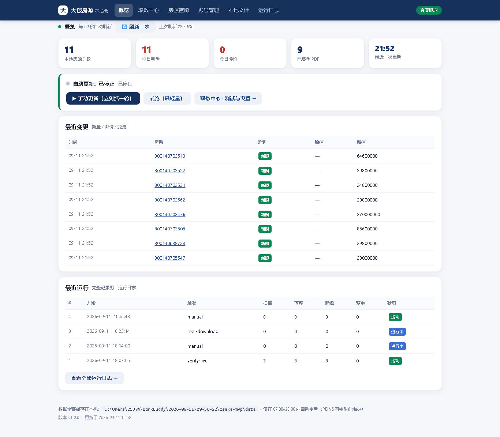

*图：「概览」页整页截图*

### 2.1 逐位置说明
| 位置 | 功能 | 背后在干什么 |
|---|---|---|
| ① 刷新条 | 每 60 秒自动刷新 +「🔄 刷新一次」+ 上次刷新时间 | 每分钟向本机服务要一次最新数字；只刷数字、**不抓 REINS** |
| ② 五张数字卡 | 本地房源总数 / 今日新盘 / 今日降价 / 已落盘 PDF / 最近一次更新 | 从**本地数据库**统计 |
| ③ 自动更新状态条 | 显示"运行中/已停止"及规则 + 三个按钮 | 决定要不要定时自动抓 |
| ④ 最近变更表 | 时间/房源/类型/原值/新值（新規、降价、変更） | 对比"这条和上次比变没变" |
| ⑤ 最近运行表 | #/开始/触发/扫描/落库/新盘/变更/状态 | 记录最近几次抓取的成绩 |

### 2.2 按钮
| 按钮 | 作用 | 背后 | 什么时候用 |
|---|---|---|---|
| `🔄 刷新一次`(见 img/btn_index_0.png) | 刷新本页数字 | 请求 `/api/overview`，重读本机数据，**不抓 REINS** | 刚更新完想看结果时 |
| `▶ 手动更新（立刻抓一轮）`(见 img/btn_index_1.png) | **立刻去 REINS 抓一轮全量** | 请求 `/api/run`：登录→检索→逐条抄详情+下 PDF→对比→写库 | 想"现在就更新一次" |
| `试跑（最轻量）`(见 img/btn_index_2.png) | 小样试跑（1 轮/最多 3 条）验证链路 | 请求 `/api/run`（trial=true） | 验证"还能不能抓" |
| `数据抓取设置·测试与设置→`(见 img/btn_index_3.png) | 跳转到【数据抓取设置】 | 跳转 `/collect` | 要配置/跑通流程 |
| `查看全部运行日志→`(见 img/btn_index_4.png) | 跳转到【运行日志】 | 跳转 `/runs` | 排查抓取问题 |

关系：试跑与手动更新是**同一件事的两种力度**，结果都进下面两张表；"数据抓取设置·测试与设置→"是**去配置它俩**的入口。

---

## 三、房源查询

**干嘛的**：在本机库里按条件找房子，数据来自本机、秒出结果。v1.1.0 起，这里也是把房子**加入对比**的入口。

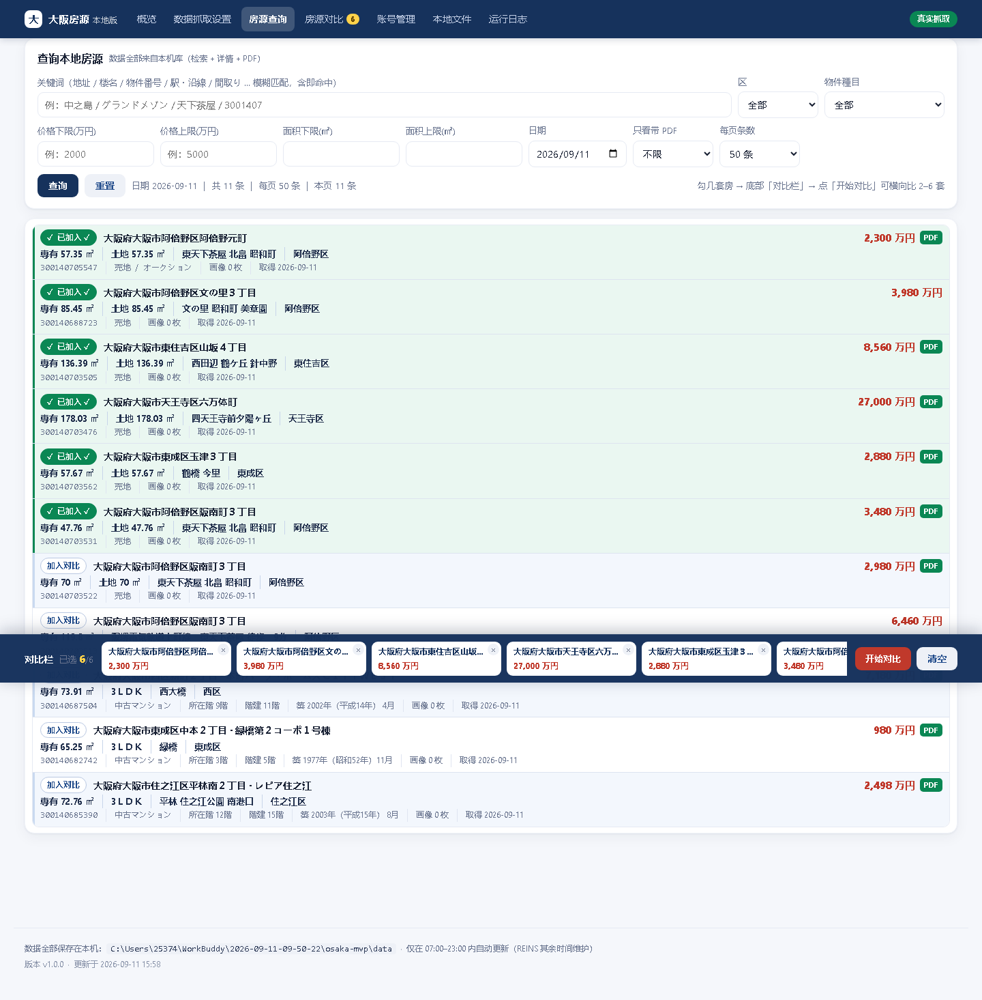

*图：「房源查询」页整页截图（v1.1.0：每行「加入对比」、工具栏「每页条数」、底部对比栏）*

### 3.1 逐位置说明
**① 查询条件区**
| 位置 | 填什么 | 背后 |
|---|---|---|
| 关键词（地址/楼名/物件番号） | 如 中之岛 / グランドメゾン / 3001407 | 模糊匹配三个字段 |
| 区 | 全部/住之江区/天王寺区… | 按行政区过滤 |
| 物件種目 | 全部/中古マンション/売地… | 按房子种类过滤 |
| 价格下限/上限(円) | 数字，可空 | 价格区间过滤 |
| 面积下限/上限(㎡) | 数字，可空 | 面积区间过滤 |
| 日期 | 默认当天，可改任意一天 | **默认只看当天**，改日期看别天 |
| 只看带 PDF | 不限/仅带 PDF | 只看已下载 PDF 的 |

**② 结果区（紧凑三行排版）**：每张卡片 = 一套房，分三层，信息密度比老版更高：
- 第一行：左边「加入对比」按钮 + 地址/楼名（蓝标题，点进详情）；右边 **降价金額 → 降价比例 → 价格（红字） → 有无 PDF**。有降价时的读取顺序是：**先看降了多少（绿胶囊「↓ 300 万円」），再看降了几个点（绿胶囊「↓ 3.2%」），最后看现在多少钱（红字价格）**——两枚绿胶囊颜色、字体完全一致（v1.1.5 调整，见 3.4）。
- 核心行（加粗）：専有/土地/建物面积、間取り、最近车站、所在区等最常用指标。
- 次要行（浅色小字，可多行）：用途地域、管理費/修繕積立金、中介、公开状态等。

**③ 每页条数 + 分页**：工具栏右侧「每页条数」下拉，**默认 50**（另可选 100 / 200）；分页加了「首页 / 上一页 / 下一页 / 末页」，并显示「共 N 条 / 第 X/Y 页」。

**④ 底部对比栏（选了房子才出现）**：固定在页面底部，显示已选的房子缩略（楼名/地址/价格/有无 PDF），右侧「清空」「开始对比」。详见 3.3。

### 3.2 按钮
| 按钮 | 作用 | 背后 |
|---|---|---|
| `查询`(见 img/btn_search_0.png) | 按条件在本地库找房源 | 请求 `/api/query`；**日期为空默认当天** |
| `重置`(见 img/btn_search_1.png) | 清空所有条件回初始 | 只清表单，不查库 |
| `每页条数`(下拉) | 切换每页显示 50 / 100 / 200 条 | 仅改前端分页大小，不重新抓库 |

### 3.3 加入对比 & 对比栏（v1.1.0 新增）
**「加入对比」按钮**：结果每行**最左边**都有一个圆角按钮（手机上是一个圆形勾选框）。点一下 → 这套房进入底部**对比栏**，按钮变绿显示「✓ 已选」；再点一下取消。

- **上限 6 套**：对比栏最多同时放 **6 套**。点到第 7 套会弹提示「最多同时对比 6 套房。请先在底部『对比栏』里点 × 去掉一套，再添加新的。」，不会加进去。
- **跨页保留**：选中的房子存在浏览器本地（localStorage），翻页/刷新/进详情再回来都还在；导航「房源对比」上的数字角标同步变化。
- **底部对比栏**：选了 ≥1 套才出现，固定在底部。点「开始对比」跳到【房源对比】页；点「清空」一键取消全部。
- **「清空」会同步刷新列表（v1.1.2 修复）**：以前点「清空」并确认后，底部对比栏消失了，但**列表里每行的「✓ 已加入」还留着**，看上去像没清掉。现在清空后，底栏、每行按钮文字/底色、导航角标**一起归零**（一处改动，三处同步）。
- **顺带加固的两种场景（v1.1.2）**：① 你在另一个标签页改了对比栏，本页会自动跟着更新；② 点浏览器「后退」回到查询页时，页面会重新对一次勾选态，不会显示旧状态。

**对比栏里的「每套房概况小卡」（v1.2.0 按你的口径重排字段）**：底部对比栏里，**每一套已选中的房子都是一张白色小卡**，一眼看清"我到底选了哪几套、都是什么货色"：

| 小卡上的行 | 内容 | 例子 |
|---|---|---|
| 第 1 行（蓝字加粗） | **名称**（楼名；无名则显示地址） | `グランドメゾン江坂` |
| 第 2 行（灰字小号） | **地址（含区）** —— 「哪个区」一定会出现 | `淀川区 大阪府大阪市淀川区…` |
| 第 3 行（灰字小号） | **専有面積**（无専有则取土地／建物面积） | `68.5 ㎡` |
| 第 4 行（红字加粗） | **价格** | `2,980 万円` |
| 右上角 `×` | 只把这一套**移出**对比栏（不影响其它已选、也不删任何房源数据） | — |

> **v1.2.0 为什么重排这四行**：你要的是「**地址、専有面積、哪个区、价格**」四项一眼可见。
> 原来的第 2 行是「間取り · 面積 · 最寄駅」——間取り/駅 对"挑哪套"帮助有限，已换成**地址（含区）+ 専有面積**两行。

- **之前为什么会整片空白（v1.1.12 修的 bug）**：一度这些卡片**全部消失**，对比栏只剩「对比栏 · 已选 6/6」和右边「开始对比 / 清空」两个按钮。根因是渲染卡片的回调里有个局部变量**跟全局文案函数 `t()` 重名**、把它遮蔽了；紧接着程序去调 `t('cmp.drop')` 取"移出"的提示文字，于是抛 `TypeError`、渲染**中途断掉**——偏偏**在断掉之前**"已选 6/6"已经画好了，所以现象是"**数字对、卡片空**"，很容易被误判成"没数据"。
- **修好后的改善**：① 卡片恢复多行摘要；② 「开始对比 / 清空」两个按钮改为**先于**卡片渲染，即便卡片出问题也不连累按钮；③ 以前存进浏览器的**老条目**缺这些信息，现在一进查询页会**自动补齐**（v1.2.0 已扩展到地址/専有面積/区三个新字段），不必重新勾选一遍。
- **怎么自己验一下**：点几套房的「加入对比」→ 底部每套都应出现一张小卡；点卡片右上角 `×` 只掉那一张，其余不动。

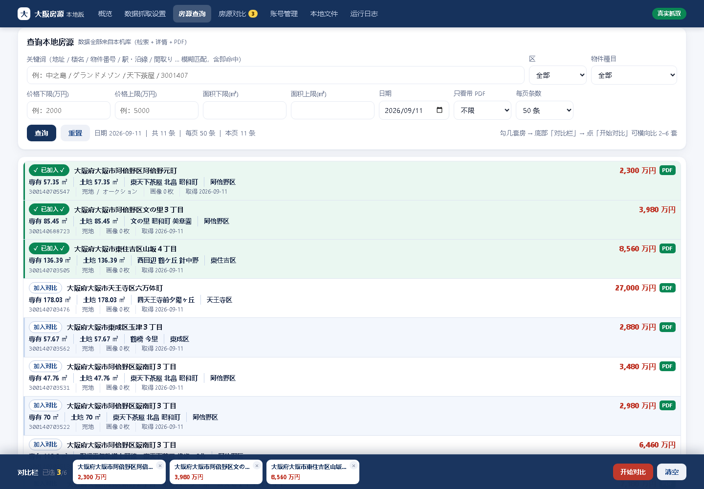

*图：选中多套后，底部出现对比栏（桌面）*

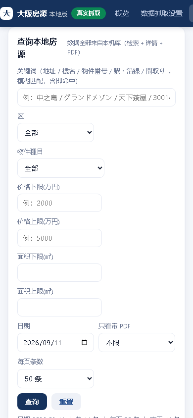

*图：手机上「加入对比」是左侧圆形勾选框，选中后底部出现对比栏*

### 3.4 降价比例（v1.1.4 新增 / v1.1.5 调整位置与样式）
**是什么**：一套房「降了几个点」。仅在**确有降价**（修改前价格 > 修改后价格）时显示，**夹在「降价金額」和「当前金額」中间**，形如 `↓ 300 万円` → `↓ 3.2%` → `8,980 万円`。

**怎么算**：
> 降价比例 = **降价額 ÷ 修改前金額 × 100%**（分母取「**修改前**」金额，不是修改后）
> 例：修改前 9,280 万円 → 修改后 8,980 万円 ⇒ 降价額 300 万円 ÷ **9,280** ≈ **3.2%**

- **分母必须用「修改前」金额**：这样才是"相对原价降了百分之几"；若误用修改后金额，结果会偏大。
- **数据来源**：本地库存有 REINS「変更前価格」字段（`previous_price`），直接取用，无需手工换算。
- **显示位置（v1.1.5 起统一）**：一律放在「**降价金額**」与「**当前金額**」**中间**。① 房源查询列表行：`↓ 170 万円`｜`↓ 1.9%`｜`8,680 万円`；② 房源详情页头：同上顺序；③ 房源对比表：写在「价格」单元格内、价格**之前**（如 `↓ 3.2%  8,980 万円`）。
- **样式（v1.1.5 起）**：与「降价金額」徽标**完全一致**——同款绿底胶囊（浅绿底、深绿字、细绿边框、圆角、同字号同字重同内边距），两枚并排视觉上是"一对"。
- **单位统一（v1.1.5 修正）**：三处的降价金額**一律带「万円」**（详情页曾漏写单位，显示成 `↓ 3,280`，已修正为 `↓ 3,280 万円`），与「当前金額」同单位，避免"一个带单位一个不带"。
- **不显示的情况**：无历史价、或价格未降（相等 / 上涨）时，不显示比例；原有的「↓ 降了多少万円」徽标不受影响。
- **语言切换**：比例只含数字与 `↓ / %`，不随界面语言变化（单位与数值一律不变）。

### 3.5 降价差额从哪儿来（数据原点）<span class="tag t-green">v1.1.8 澄清</span>

**一句话**：徽标上"降了多少万円 / 降了几个点"，取的是本机两列之差 —— `previous_price`（REINS 的「変更前価格」）**减** `price`（当前「価格」）。这个差价的**原点**是 REINS 自己的一个字段，**不是**我们拿你两次下载去比出来的。

**两个字段分别打哪来（代码可查，绝不靠猜）**：
- `price`（当前価格）：来自 REINS **列表页网格**的「価格」列（`core/crawler.py → LIST_FIELD_MAP` 的 `(2,5)→price`）；进详情页时详情页「価格 / 基本価格」也会写同一值。这是 REINS 此刻挂牌的**当前价**。
- `previous_price`（変更前価格）：**只**来自 REINS **详情页**的「変更前価格」字段（`core/crawler.py → LABEL_MAP["変更前価格"] → previous_price`）。**列表页网格没有这一列**，所以 `previous_price` 只在"进详情页抓全字段"那一刻写入本机；之后遇到"已存在（仅刷新列表字段）"的刷新，列表行里没有这列，它**不会被更新**（冻结在首次抓到的值）——除非回详情页补抓（见 8.4 议题③）。

**这是"一跳"，不是"累计"——最容易混淆的点**：
- 徽标显示的差额 = REINS 记录的"**它上一次改价前的价格 → 现在**"这一跳。例：REINS 把某房从 800万 改到 700万，它会把「変更前価格」记成 800万、「価格」记成 700万，徽标就显示 ↓100万 / ↓12.5%。
- 它**不等于**"你第一次下载时是 1000万、现在是 700万、累计降了 300万"。那种**累计降幅**只存在于本机 `changes` 表 / `snapshots` 表——前提是：我们确实在某次刷新抓到过 1000万，又在另一次刷新检测到它降到 700万（详情页「变更历史」会逐条列出 `降价 1000万 → 700万`）。
- 所以：**看"这一跳降多少"看徽标；看"从我第一次关注到现在累计降多少"看详情页「变更历史」+「抓取快照」。** 两者来源不同，别混。

**实证（房源 300138196739 / 9号）**：本机当前 `previous_price = 699万`、`price = 698万` → 徽标 `↓1万 / ↓1.4%`。本机两次刷新都抓到 698万、没检出新降价；那 1万 就是 REINS 自报的"変更前 → 現在"这一跳。若你想确认"从某天到现在累计降了多少"，去详情页看「变更历史」里有没有 `降价` 行（没有就说明我们没抓到过更早期的价格）。

---

### 3.6 物件種目：两级目录 · 复选框联动 <span class="tag t-green">v1.1.9 新增 / v1.1.10 重做 / v1.1.11 补全種目</span>

**一句话**：房源查询页的「物件種目」筛选是**两级目录**，拆成 **① 一级类目（物件種別）** 与 **② 二级类目（物件種目）** 两个**明确分开的选择区**，每个选项前面都带**复选框**；**先勾①一级，②二级才可选**。既遵循 REINS / 原始分类（一戸建 4 種目、公寓 4 種目、土地），又支持"跨一级同时选"和"跨二级同时选"，把"想看哪些房型"的选择权完整交还给用户。

**面板长这样**（点「物件種目」按钮弹出，按钮文案随已选变化）：


*图：两级目录面板——① 一级类目（物件種別）是一列带复选框的选项；② 二级类目（物件種目）按对应的一级分组、排在下面。*（截图为早期版本；**v1.1.11 起二级種目已补全为每类 4 个**，见下方表格。）

**v1.1.10 为什么重做**：v1.1.9 的第一版把两级**混在同一个列表**里、一级勾选框只当"整组开关"，看上去不像"两个不同的选择项"，也分不清哪是一级哪是二级。v1.1.10 改成 **① / ② 两个清楚分开的选择区**，并加上**联动**：一级没勾时，它下面的二级**置灰、点不动**；勾上一级之后，对应的二级才可以勾。

**v1.1.11 为什么再补一次（二级種目补全成 REINS 原样）**：v1.1.10 的二级还是笼统的「新築 / 中古」，一个一级只有 **2 个**。但 REINS 原版里，公寓（マンション）的「物件種目」有 **4 个**——新築マンション / 中古マンション / 新築タウン / 中古タウン；一戸建也有 **4 个**——新築戸建 / 中古戸建 / 新築テラス / 中古テラス。v1.1.11 把二级**补全成 REINS 原版的種目（一级 4 个、公寓 4 个）**，名称**直接采用 REINS 原值**（和原版一致，不随界面语言变），这样"只想看中古マンション"或"想连中古タウン一起看"都能精确勾选。

**① / ② 两个选择区（v1.1.11）**：

| 区 | 是什么 | 里面有 |
|---|---|---|
| **① 一级类目**（物件種別） | 一列带复选框的选项；勾上＝默认选中它下面全部二级 | 一戸建 / 公寓（マンション）/ 土地（外加「其他」兜底组，**仅当**库里有归不进目录的種目时才出现） |
| **② 二级类目**（物件種目） | 按对应的一级分组、排在**下面**；只在该一级已勾选时才可勾 | 一戸建 → 新築戸建 / 中古戸建 / 新築テラス / 中古テラス；公寓 → 新築マンション / 中古マンション / 新築タウン / 中古タウン |

**两级目录的数据结构**（一级＝分组，二级＝可勾选的叶子）：

| 一级（① 类目 / 物件種別） | 二级（② 目 / 物件種目，可勾） | 叶子 key |
|---|---|---|
| 一戸建（売一戸建） | 新築戸建 / 中古戸建 / 新築テラス / 中古テラス | `house_new` / `house_old` / `house_terrace_new` / `house_terrace_old` |
| 公寓（売マンション） | 新築マンション / 中古マンション / 新築タウン / 中古タウン | `apt_new` / `apt_old` / `apt_town_new` / `apt_town_old` |
| 土地（売土地） | （一级本身即叶子，无二级） | `land` |
| 其他（兜底） | 库里出现、但归不进上面三类的種目（如 中古リゾート），逐条列出；**当前库里没有这类，故该组不显示** | `x:原始種目`（精确匹配） |

**联动规则（v1.1.10 的核心）**：
- **先勾①一级，②二级才可选**：某个一级一个都没勾时，它那组二级**置灰、不可点**；面板②区标题旁有提示「先勾①一级类目，二级才可选」（一旦有选中就收起）。
- **勾一级 = 默认把其下二级整组勾上**，可再**单独取消**某一个二级 → 此时一级勾选框变成**「半选」**态（方块里一道横线）。
- **取消一级 = 其下二级一并取消**，该组回到置灰不可点。
- **① 跨一级同时选**：勾「一戸建」整组 + 「公寓」整组 → 结果 = 一戸建 ∪ 公寓（既能看一户建也能看公寓）。
- **② 跨二级同时选**：在公寓里只勾「新」、在一戸建里只勾「中古」→ 结果 = 二者并集。
- **一个都不勾 = 不限（全部）**：面板初始状态即"全部"，不强制选任何项；点了「清空」也回到"全部"。
- **「土地」等"一级即叶子"的项**：②区对应位置显示一行小字说明「该一级本身就是叶子，无需再选二级」，不提供二级复选框。
- **按钮文案**：未选或全选显示「全部」；选 1–2 项显示具体名字（如「一戸建·公寓」）；选 ≥3 项显示「等 N 项」并在 `title` 里存全名，避免按钮过长把面板挤变形。

**兜底「其他」组（保证任何一条房源都筛得出来）**：
- 本机库存的 `property_subtype`（原始種目）列，**实测全为 NULL**，只有 `property_subtype` 文本有值，且常带换行后缀（如 `中古マンション\n／\nオーナーチェンジ`）。
- 所以分类靠**关键词 LIKE 匹配**（组内 OR、组间 AND）：一戸建＝「戸建」×（新築 / 中古）、「テラス」×（新築 / 中古）；公寓＝「マンション」×（新築 / 中古）、「タウン」×（新築 / 中古）；土地＝「土地」或「売地」。
- 凡是**以上都匹配不上**的原始種目，自动归入「其他」组，叶子 key 写成 `x:原始種目`、**用原始種目文本精确匹配**——这样哪怕 REINS 以后加了新后缀、新叫法，那条房源也不会从筛选里"消失"，用户勾「其他」里的具体项照样能筛出来。
- **覆盖率已实证**：副本库 280 条房源，8 个種目叶子 + 土地 关键词匹配合计 280 条 = 100% 覆盖（公寓 4 種目 222 条、一戸建 4 種目 8 条、土地 50 条）；当前库里没有任何「归不进目录」的種目，故「其他」组**暂不显示**（一旦 REINS 出现新種目，它会自动出现兜底）。

**URL / 接口怎么传参（向后兼容）**：
- 多选走 URL 重复参数：`subtype=house_new&subtype=apt_old`，后端 `request.args.getlist("subtype")` 收成数组。
- 旧的**单值**参数 `subtype=中古マンション` 仍认（自动转成数组），`subtypes=['中古マンション']` 也认 → 老书签 / 老调用不受影响。

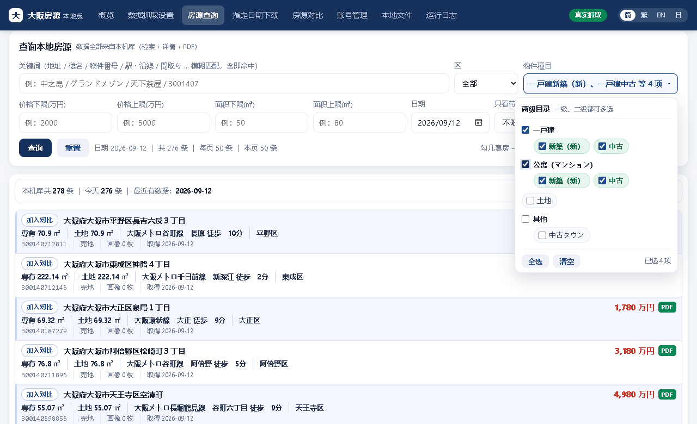

*图：收起态——按钮显示「等 N 项」或具体名字；面板贴窗口右缘时自动向左翻转，不会被裁切。*

**一句话记住**：物件種目现在是「一级分组开关 + 二级叶子」的两级多选面板，跨组、跨新中古都能同时勾，归不进目录的原始種目进「其他」兜底，任何房源都筛得出来。

### 3.7 列表行「新增 / 变更」状态标 <span class="tag t-green">v1.1.10 新增</span>

**一句话**：房源查询列表**每行**的左侧（紧贴「加入对比」按钮右边）会显示一枚**实心小标签**，一眼告诉你这套房和「今天」的关系——是**本轮首次新入库**的，还是**库中已有、但今天发生了变更**。

| 标签 | 颜色 | 含义 | 什么时候出现 |
|---|---|---|---|
| **新增** | 实心绿 | 这套房**今天第一次进本机库**（本轮新抓到的） | 该房源今天的 `change_type` 含 `new` |
| **变更** | 实心橙 | 这套房**之前就在库里**，但**今天有变更**（价格/字段动了、或降价/涨价） | 该房源今天有任意变更（`price_down` / `price_up` / `modified`）且不含 `new` |
| （无标签） | — | 既不是今天新增、也不是今天变更（只是命中筛选的老房源） | 该房源今天在 `changes` 表里没有记录 |

**显示位置与样式**：
- 标签贴在**第一行左侧「加入对比」按钮的右边**，和「加入对比」并排，扫一眼就能把"要不要关注"和"加不加入对比"两件事一起决策。
- 样式为**圆角实心胶囊**（绿=`新增`、橙=`变更`），字号 11px、加粗，`white-space:nowrap` 不折行；四语言文案分别 `row.tag_new` / `row.tag_changed`（新增→新規/新增/New，变更→変更/變更/Changed）。
- **「加入对比」按钮本身不变**：它继续表达"加入 / 已加入"——状态标说的是"这套房和今天的关系"，「加入对比」说的是"你有没有把它放进对比篮"，两者**职责不同、不互相替代**。

**数据从哪来**：标签由后端算好随查询结果下发（不靠前端再查）。后端 `core/store.py → change_types_on(date)` 取「某天 `changes` 表里各房源的变更类型」，`web/app.py → api_query()` 给每行附上 `tag`：`new` → `新增`；其余变更 → `变更`；都没有 → 空。所以**切换日期**时标签跟着变——看 2026-09-11 就会显示那天的新增/变更，看当天（默认）就是今天的。

**典型场景**：跑完一轮下载，列表第一眼扫——绿标=今天新盘（重点看）、橙标=今天有动静的老房（重点比对价格）、无标=安静的老房源（一般不急）。配合 3.4 的降价比例，能一眼区分"新盘降价"和"老房今天降了"。

---

### 3.8 下载完整性：本地条数为什么比线上少 <span class="tag t-green">v1.1.12 修复</span>

**一句话结论**：**不是筛选逻辑错了，是下载器给自己设了上限、还把几个条件塞进同一份额度里。** 你在 REINS 上查到 117 件 / 454 件，本地却只有 8 件 / 222 件。v1.1.12 把根因全部修掉——现在「一戸建 2 项」「公寓 4 项」勾好下载，条数应与线上一致。

#### ① 现象（用户报的问题）

| 筛选 | 线上（REINS 查询结果） | 修复前本地库 | 差 |
|---|---|---|---|
| **一戸建**（新築戸建 + 中古戸建） | **117 件** | **8 件**（且新築戸建 = 0） | 少 109 |
| **公寓**（新築/中古マンション + 新築/中古タウン） | **454 件** | **222 件**（10 + 211 + 1） | 少 232 |
| 全库 | — | 280 条 | — |

**物证**：`runs` 表里多轮记录都是 `scan=200 fetch=200`——**精确卡在 200**，这就是硬上限的痕迹。

#### ② 三条根因（叠加造成）

1. **配额硬截断**：`config.yaml` 里 `max_items_per_run: 200`、`max_pages: 7` → 一轮最多抓 200 条、最多翻 7 页，线上的 454 条根本抓不完。
2. **跨保存条件共用一份配额（一戸建被"饿死"的主因）**：保存条件 `01 = 売土地 + 売一戸建` 是**混在一起**的，而代码里计数是**跨条件累计**；在"最新順"排序下，200 条额度几乎被土地类新盘吃光，一戸建只剩 8 条。
3. **種目一次只填一个 + 最新順排序**：REINS 的種目槽位原先只填第 1 个，搭配"最新順"，固定翻前几页永远只看到最新那批，**老房源永远进不来**。

#### ③ 修了什么

| 改动 | 位置 | 改成 |
|---|---|---|
| **上限调大** | `config.yaml` | `max_items_per_run` **200 → 5000**；`max_pages` **7 → 300** |
| **每个保存条件各一份配额** | `core/crawler.py` | `_live_items()` 每个条件**独立计数**；`_collect_from_results()` 只认本次调用自己的计数（不再全局共用），到顶会打告警 |
| **同一次检索填满 4 个種目槽位** | `core/crawler.py` | 新增 `_fill_subtype_slots()`：按 REINS「基本条件」的**两行布局**（第 1 行放前 2 个種目、第 2 行放后 2 个）填 `物件種別１/２` + `物件種目１/２`——**只发 1 次检索请求**（不是逐個種目各跑一遍），请求更少、更像人、更不容易被风控 |
| **勾「所有権のみ」** | `core/crawler.py` | 新增 `_tick_ownership_only()`：检索前勾 `土地権利/借地権種類 = 所有権のみ`（与线上口径一致）；**勾不上 → 自动退回「指定なし（全部）」** |
| **前端配套** | `web/templates/specified.html` | 物件種目改为 **4 + 4 + 1 分组多选**（一戸建 4 个 / 公寓 4 个 / 土地 1 个）；新增复选框 `土地権利/借地権：所有権のみ（推荐，与线上口径一致）`，**默认已勾** |
| **参数透传** | `web/app.py` | `_opts_from_body()` 收 `subtypes` 列表 + `ownership_only` |

#### ④ 你这边怎么用（3 步）

1. **重启一次 `start_mvp.bat`**（本次改了 `.py`，而 **`.py` 不热重载**；模板 / JS / 样式会热重载）。
2. 打开【数据抓取设置 → 第 4 步 下载条件】：`物件種別` 选 **売マンション**，`物件種目` 勾 **新築マンション / 中古マンション / 新築タウン / 中古タウン**。
3. 点 **① 确定**，预览条数应约 **454**；一戸建同理（`売一戸建` + 新築戸建/中古戸建）应约 **117**。

#### ⑤ 还剩一个口径差（已知、偏多不偏少）

本机**不抓「土地権利」这个字段**，所以即便勾了"所有権のみ"，本地字段里也看不到它。万一某轮**勾不上**这个条件、退回"全部"，本地数会**略多于**线上（把借地権的也抓进来了）——**方向是偏多，不是偏少**。

#### ⑥ 第一次跑完请看日志确认一句

那 4 个槽位的选择器是**按 label 文案定位**的（`物件種別１` / `物件種目１` 在页面上各有两个，取第 1、第 2 个），只有**真跑一次**才能确认是否都填进去了。第一次跑完请确认日志里有 `· 已选 物件種別１ …` 与 `· 已勾 土地権利…所有権のみ` 这两行；若出现 `⚠ 物件種目 一个都没填进去，本次按「全部」检索`，说明选择器需按真机 DOM 再校准（此时数量同样**偏多而非偏少**）。

### 3.9 查询条件会被记住 <span class="tag t-green">v1.2.0 新增</span>

**你的原话**：「在我查询完一次，再点其他页面再回来的时候，它原先的信息需要保留，不要给我清空到默认状态。」

**现在的行为**：

| 场景 | 结果 |
|---|---|
| 查询页设好条件 → 点「房源对比」→ 再回「房源查询」 | **条件原封不动还在**，并自动按这套条件重新查询 |
| 关键词 / 区 / 日期 / 物件種目多选 / 价格 / 面积 / 每页条数 | 全部记住 |
| 关掉浏览器、第二天再打开 | 也还在（存在浏览器本地 `localStorage`） |
| 想回到默认 | ① 点筛选区的**「重置」**按钮；② 或点提示条上的「**重置为默认**」 |

- **提示条**：如果当前显示的是上次记住的条件，按钮行会出现一行小字「**当前为上次的查询条件 · 重置为默认**」，避免你遇到"想回默认却回不去"的别扭。
- **点了「查询」或翻页之后**，这行提示会自动收起（表示"这是你当前主动选的条件"）。
- **「重置」按钮 = 显式清空**：一键回到默认（当天 / 不限種目 / 不限区价），并同时清掉记住的条件。

### 3.10 展开区的字段名会跟着语言变 <span class="tag t-green">v1.2.0 新增</span>

**你的原话**：「房源查询页展开页里面有很多名称是英文的，尽可能地把它转换成对应的语言……不要使用从网上扒下来的字段名称。」

**改了什么**：房源查询页点开某一行后，下半部分是**从详情页抓回来的附加字段**。这些字段在本机库里存的是**英文键**
（`trade_type`、`management_fee`、`repair_fund`、`broker`…，抓取时定的），以前**直接把英文键当标签显示**，所以你看到一堆英文。
v1.2.0 起**统一走一份公共字段词典**（`web/static/fieldmap.js`），按当前语言显示：

| 你看到的（以前） | 简体 | 繁體 | English | 日本語 |
|---|---|---|---|---|
| `trade_type` | 交易方式 | 交易方式 | Trade type | 取引態様 |
| `management_fee` | 管理费（每月） | 管理費（每月） | Management fee (mo.) | 管理費（月額） |
| `repair_fund` | 修缮积立金（每月） | 修繕積立金（每月） | Repair fund (mo.) | 修繕積立金（月額） |
| `broker` | 中介公司 | 仲介公司 | Agency | 仲介会社 |
| `use_zone` | 用途地域 | 用途地域 | Use zone | 用途地域 |
| `selling_point` | 卖点 | 賣點 | Selling points | セールスポイント |
| `facilities` | 设备 | 設備 | Facilities | 設備 |
| `remarks` | 备注 | 備註 | Remarks | 備考 |

**同一条规则，三处共用**：查询页展开区 / 房源对比页 / 房源详情页——**同一份词典**（约 20 个字段 + 兼容 REINS 日文键），
改一处三处一起变，不会再出现"这页中文、那页英文"。

**⚠ 关于译名的硬规则（你特别强调的那条）**：

> **所有字段名一律来自本项目的 i18n 字典（`xf.*` 系列），由我们按业务含义自己定义；
> 禁止照抄 REINS 官方译名或第三方网站（含各种"日本买房攻略"类网站）的译法。**
> 未收录的键**保留原始键**、不擅自翻译——宁可露出原键（方便我们补词表），也不要一个来路不明的译名。

举例：`broker` 译成「**中介公司**」，而不是网上常见的「经纪人」「宅建业者」；`repair_fund` 译成「**修缮积立金（每月）**」，
单位与口径都按我们自己的定义写全。

---

## 四、房源详情

**干嘛的**：看一套房的全部字段、变更历史、抓取快照。v1.1.0 起排版更紧凑；v1.1.2 起对比改为**两步走**（「加入对比」→「去对比」）。

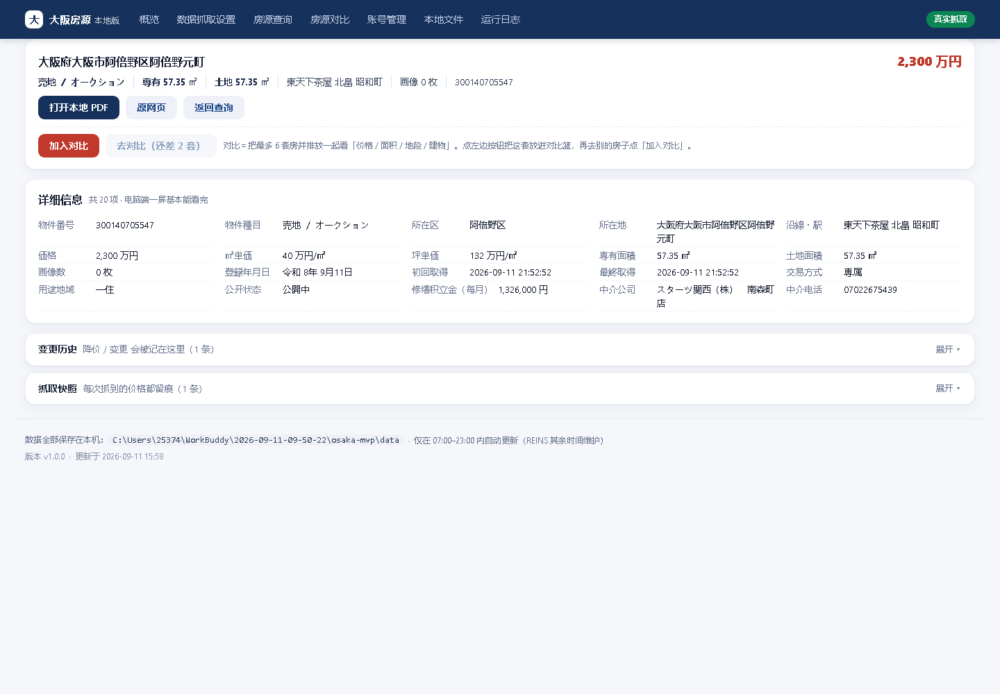

*图：「房源详情」页整页截图（v1.1.0 紧凑排版：核心信息胶囊置顶、密集网格、历史折叠）*

### 4.1 逐位置说明
| 位置 | 功能 | 背后 |
|---|---|---|
| ① 顶部一行关键信息 <span class="tag t-green">v1.2.0 补齐四项</span> | **位置**（地址）+ **名称**（楼名）+ 降价金額 + **降价比例**（绿胶囊）+ **价格**（红）+ **面积**（灰胶囊：専有 / 土地 / 建物取其一） | 核心四项「**位置 / 名称 / 价格 / 面积**」一眼可见，与对比页列头口径一致 |
| ② 核心 meta 胶囊 | 種別 / 区 / 駅 / 面积 / 間取り / 築年月 / ㎡单价 等 | 最常用指标做成胶囊，置顶 |
| ③ 详细信息（密集网格） | 物件番号/所在地/交通/価格/前回価格/㎡单价/坪单价/専有·土地·建物面积/階/築年月/画像数/登録·変更年月日，以及详情页抓到的其他字段（交易方式/用途地域/管理費/修繕積立金/中介公司/中介电话/公开状态等，均译成中文） | 从 REINS **抄回的原文**，存本机 |
| ④ 提示 + 按钮 | 「这条没有抓 PDF。」/「加入对比」/「去对比」/「原网页」/「返回查询」 + 一行说明文字 | 对比是"先加入、再一起比"的两步 |
| ⑤ 变更历史 / 抓取快照 | 用 `details` 折叠，默认收起 | 变化记录与"下次抓时变没变"的依据 |

> **紧凑目标**：桌面端一页显示完；手机端核心信息放最上面，**不超过两页**即可看完。

### 4.2 按钮
| 按钮 | 作用 | 背后 |
|---|---|---|
| `加入对比`(v1.1.2 改) | 把这**一套**放进本机浏览器的「对比篮」（最多 6 套）。**再点一下 = 取消** | 读写浏览器本地 `localStorage`，不联网；按钮文字实时显示「已加入对比 ✓（N/6）」 |
| `去对比`(v1.1.2 新增) | 跳到【房源对比】页，把这 N 套并排比 | 跳转 `/compare`（读对比篮里的全部，**不是**只带这一套） |
| `原网页`(见 img/btn_detail_0.png) | 新标签打开 REINS 原始页面 | 跳 REINS 对应链接 |
| `返回查询`(见 img/btn_detail_1.png) | 回【房源查询】 | 跳转 `/search`（不带上次筛选） |

### 4.3 这一版为什么把「对比」拆成两步？ <span class="tag t-green">v1.1.2 说明</span>

**改了之前会遇到的坑（原设计的问题）**

v1.1.0 时这里是**一个**按钮，写着「和已选的房子对比」，点下去会带着"本套房"直接跳到对比页（`/compare?nos=本套`）。结果出现两个问题：

1. **只有一套，根本没得比** —— 对比的定义是"至少两套并排看"，一进页只能看到一句"还不够 2 套房"，让人莫名其妙（这就是你说的"它没有对比，就出现这样的问题"）。
2. **把之前选好的房子顶掉** —— 跳转时只带本套房，你之前在查询页辛辛苦苦选的其它房子就没了。

**现在的两步，各自负责一件事**

| 步 | 按钮 | 做什么 | 什么时候用 |
|---|---|---|---|
| ① | `加入对比` | 把**当前这一套**放进「对比篮」（就像超市先把东西放购物车，不结账） | 你看到一套想纳入比较的房 |
| ② | `去对比` | 凑够 2 套后，一次性把篮子里**全部**的房子并排比 | 你觉得选得差不多了，想看结果 |

**几个贴心细节**
- 按钮上**永远写着当前已选几套**：「加入对比（已选 2/6）」→ 点完变「已加入对比 ✓（3/6）」，一眼知道进度。
- 已选时再点一下 = **取消**（同名切换），不用去找哪里删。
- 不足 2 套时「去对比」是**灰的**，硬点会提示你先再加一套（并告诉你加在哪）。
- 说明文字会随状态变：没选时解释"对比是干嘛的"；已选时告诉你"还差几套"。
- **不会覆盖你之前的选择**（这是重点，和 v1.1.0 的行为不同）。

---

## 五、房源对比（v1.1.0 新增，对标中关村在线）

**干嘛的**：把查询页「加入对比」选中的 **2–6 套**房，在一张表里**横向并排比**，一眼看出哪套更好、哪套不够好。设计参考中关村在线笔记本对比页（横向表 + 标最优 + 隐藏相同项）。

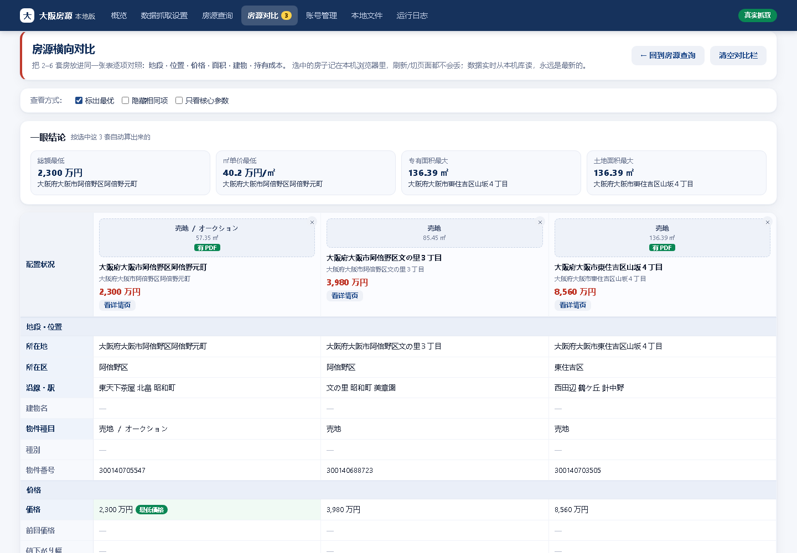

*图：「房源对比」页整页截图（桌面：一眼结论 + 横向表 + 三组开关）*

### 5.1 怎么进这个页
- **查询页**：点「加入对比」选 2–6 套 → 点底部对比栏「开始对比」；
- **详情页**（v1.1.2 改）：点「加入对比」把这套放进篮子 → 凑够 2 套后点「去对比这 N 套 →」；
- **导航栏**：直接点「房源对比」（若对比篮里已有 ≥2 套）。

> **只选了 1 套 / 一套都没选时会怎样（v1.1.2 改）**：不会再甩一句"还不够 2 套房"就完了，而是给一个**引导页**——告诉你「你目前只选了 1 套：〈楼名〉（番号）」，还差几套，并直接给「回查询页再选 1 套」按钮；一套都没有时，指路去查询页点「加入对比」。

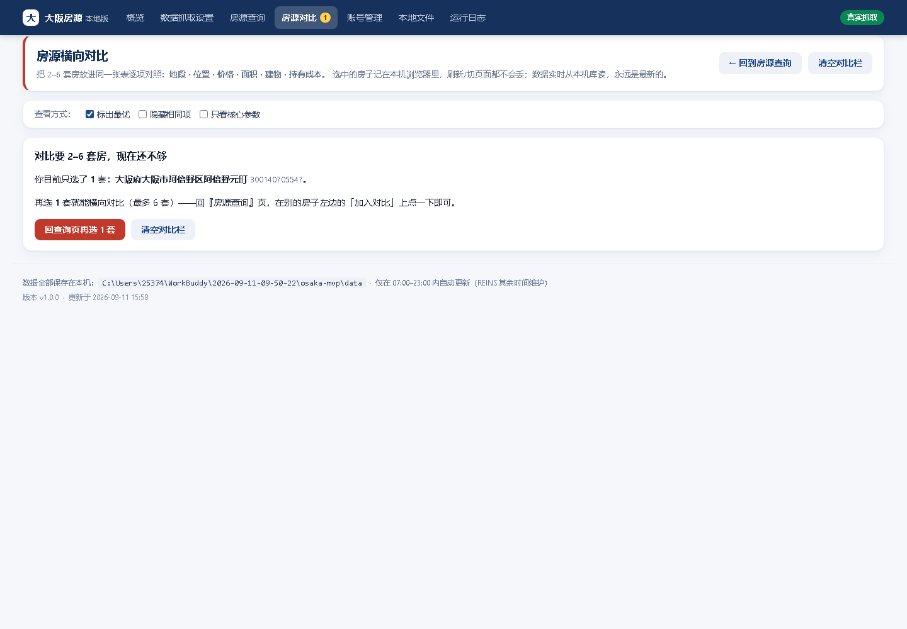

*图：只选 1 套时进【房源对比】，页面会说明现状并给下一步入口（v1.1.2）*

### 5.2 页面结构（从上到下）
1. **一眼结论（速览卡）**：按当前选中的几套自动算 5 条——総額最低 / ㎡单价最低 / 专有面积最大 / 土地面积最大 / 筑年最新，每条直接标出是哪套房。
2. **横向对比主表**：第 1 列是参数名，后面每列一套房（表头含缩略图/楼名/地址/价格/「看详情页」「× 移出」）。
3. **分组**：地段·位置 / 价格 / 面积·間取り / 建物 / 记录 / 附件·操作，每组一个通栏标题，信息分块更清楚。
4. **详情页的其他信息（并集）**：把各套详情页抓到的"其他字段"合并展示（交易方式/用途地域/管理費/修繕積立金/中介公司/中介电话/公开状态…），未填的显示「—」。

### 5.3 三个开关（工具区）
| 开关 | 作用 |
|---|---|
| **标出最优** | 在数值类行里给"最优"那套打「最优」标记（价格/单价取最低，面积/筑年取最高） |
| **隐藏相同项** | 把所有套房取值都一样的行收起，只看"有差异"的参数 |
| **只看核心参数** | 只留最核心的一组参数，隐藏"详情页的其他信息"那块 |

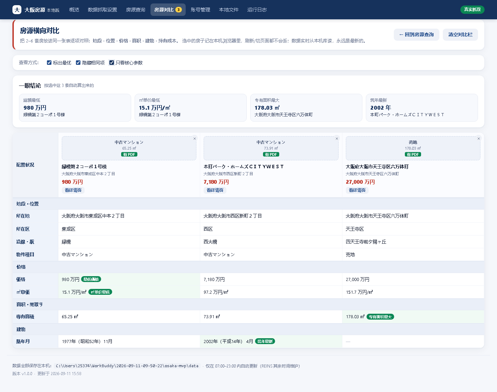

*图：勾选「只看核心参数」后，主表只留核心参数（手机上表格可左右滑动）*

### 5.4 手机上的体验
表格在手机上**横向滚动**（提示「← 手机上左右滑动表格 →」），首列参数名固定不动，方便边滑边比。

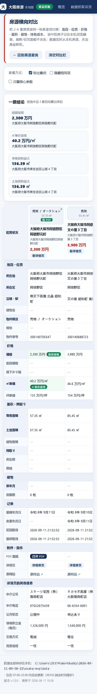

*图：「房源对比」页手机视图*

### 5.5 背后的接口
- 数据来自本机库：前端调 `/api/compare?nos=番号1,番号2,…`，后端实时从 `jproperty.db` 取这几套的完整字段返回。
- 选中集存在浏览器本地（localStorage，key=`osaka.compare.v1`，上限 6），跨页保留；进对比页时回写校正，保证"已选 N 套"和表格一致。

### 5.6 「清空对比栏」为什么以前会"清不掉"？ <span class="tag t-green">v1.1.2 修复</span>

**现象**：在对比页点「清空对比栏」并确认后，本以为页面会变空，结果房子**又自己回来了**（表格还是那几套）。

**原因**：清空这个动作会触发一次"对比栏变了 → 重新加载页面"的联动。当时执行的顺序是「先清空 → 再改地址栏 → 再重载」，而那次自动重载**读的还是旧地址栏**（里面还带着 `?nos=A,B,C`），于是又照着旧地址把 A、B、C 加载了回来，等于白清。

**修复**：把顺序理正 —— **先**把地址栏的 `?nos=` 去掉 → **再**清本机选中 → **最后**重载，并且给这次"自己改自己"的操作加了一个开关，避免它再触发一次多余的自动重载。
现在点「清空对比栏」的结果是：表格消失、导航角标归零、地址栏变成干净的 `/compare`、并显示"还不够 2 套"的引导页。

> 同理，对比表里点某一列右上角的 `×` 移出（尤其是**移出最后一套**时）也走同一套逻辑，不会再"复活"。

---

## 六、数据抓取设置（最重要）

**干嘛的**：抓数据前的一切准备与设置，按 1→2→3→4 四步排好，照顺序点即可。

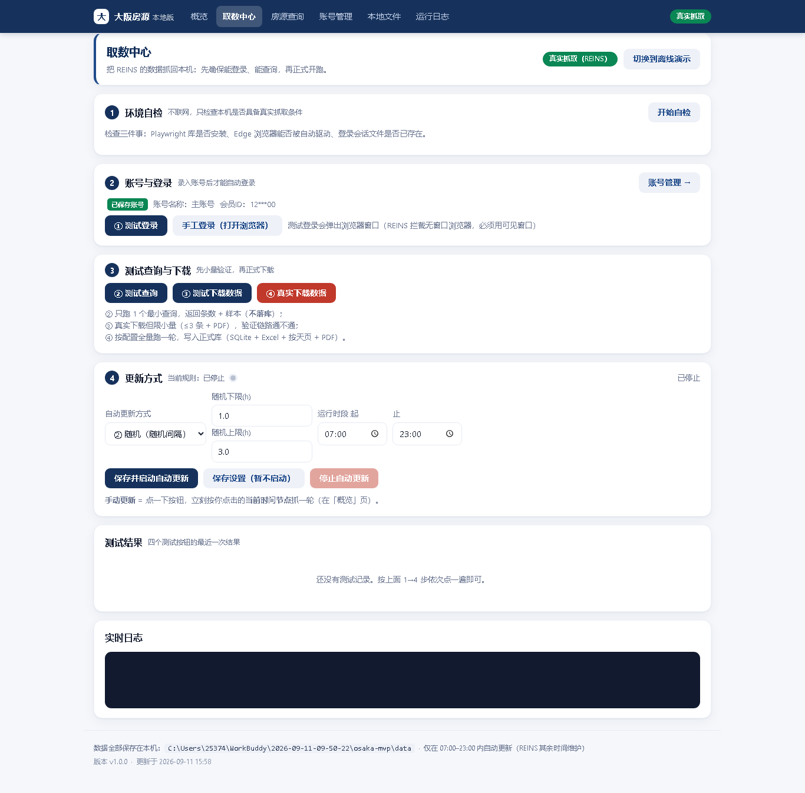

*图：「数据抓取设置」页整页截图（原名「取数中心」，v1.1.0 更名）*

### 6.1 顶部：模式切换
`真实抓取（REINS）`(见 img/badge_mode.png)(只读徽标) + `切换到离线演示`(见 img/btn_collect_0.png)
- **作用**：在真实抓取 / 离线演示间切换（按钮文字随当前模式变化）。
- **背后**：请求 `/api/mode`，改配置 `app.mode`。演示模式下"真实"操作会被拒绝。

### 6.2 第 1 步 环境自检
`开始自检`(见 img/btn_collect_1.png)
- **作用**：检查本机是否具备抓取条件（不联网）。
- **背后**：请求 `/api/env`，检查 ① Playwright 库 ② Edge 能否被自动驱动 ③ 登录会话文件是否存在。

### 6.3 第 2 步 账号与登录
`账号管理 →`(见 img/btn_collect_2.png) `① 测试登录`(见 img/btn_collect_3.png) `手工登录（打开浏览器）`(见 img/btn_collect_4.png)
| 按钮 | 作用 | 背后 |
|---|---|---|
| 账号管理 → | 去录入/修改账号 | 跳转 `/account` |
| ① 测试登录 | 用存好的账号自动登录 REINS 验证 | `/api/login/auto`，弹可见浏览器自动填表；成功存会话 |
| 手工登录（打开浏览器） | 由你亲手输账号密码（适合有验证码） | `/api/login`，等你操作并保存会话 |

> 顺序：**①测试登录必须在②测试查询之前**，没登录后面都会失败。

**会话过期了会怎样？<span class="tag t-green">v1.2.1 自愈</span>**

REINS 的登录会话是有时效的（无操作一段时间后服务端就判过期）。过期后页面会回一句
「セッションがタイムアウトしました。」，此时**抓取一律 0 条**——这正是「本地条数不涨、
日志只说会话失效」的原因。

v1.2.0 及以前：只要 `data/session.json` **文件存在**就直接拿去用，**从不判断它是否还有效**，
所以会话一过期，**每一轮**都直接停机，必须人工去点一次登录，自动更新等于空转。

v1.2.1 起改成**自愈**：抓取入口（自动轮次 / 手动更新 / 测试查询 / 指定日期预览与下载）
统一先打开搜索页确认登录态，一旦发现过期就**自动用本机保存的账号重登一次**，成功则用
新会话继续这一轮；重登仍失败（比如账号要验证码）才停机，并明确提示去「账号管理」点
**「手工登录」**。红线不变：只填表提交一次，**不重试、不识别验证码、不换 IP**。

### 6.4 第 3 步 测试查询与下载 <span class="tag t-green">v1.2.0 收窄</span>
`② 测试查询`(见 img/btn_collect_5.png) `③ 测试下载数据`(见 img/btn_collect_6.png)
| 按钮 | 作用 | 背后 |
|---|---|---|
| ② 测试查询 | 最小查询，看能否查到 | `/api/query/test`，**不落库** |
| ③ 测试下载数据 | 小量真下载（≤3 条+PDF）验证链路 | `/api/download/test`，落库少量 |

> v1.2.0：**测试区只做"验证链路"这一件事**（按你的要求「测试功能保持原样」）。
> 原来的「④ 真实下载数据」已并入第 4 步「下载条件」——因为"正式下载"必须先能配条件。

### 6.5 第 4 步 下载条件 <span class="tag t-green">v1.2.0 新增（原「指定日期下载」页并入）</span>

**这是什么**：决定「正式下载」到底抓什么。原先是**独立的一个页面**（左侧导航里的「指定日期下载」），
v1.2.0 把它**整体并入本页**，成为第 4 步——因为它本质就是"下载条件"，放在「数据抓取设置」里才顺。

> 老链接 `/specified` 仍可用，会自动跳到本页这个区块（`/collect#dlcond`），书签不会失效。
> 顶部导航因此从 8 项减为 **7 项**。

#### (a) 核心条件（已按你的常用口径预置，不用改就能直接下）

| 项 | 内容 | 默认 |
|---|---|---|
| 物件種別（分组多选） | 売一戸建 / 売マンション / 売土地 三组，各组内勾选具体種目 | 默认勾 一户建2个 + 公寓4个（土地不勾） |
| 物件種目 · 一戸建 | **新築戸建、中古戸建**（只给这 2 项） | 全勾 |
| 物件種目 · 公寓 | **新築マンション、中古マンション、新築タウン、中古タウン**（前 4 项） | 全勾 |
| 物件種目 · 土地 | 土地 | 全勾 |
| 日期 | **当天登录**（登録年月日＝当天）<br>**当天更新**（変更年月日＝当天） | **两个都勾** |
| 指定日期 | 默认今天 | 今天 |
| 土地権利/借地権 | 所有権のみ | **勾选** |

- **日期两个都勾会怎样**：登录日跑一次、更新日跑一次，两次结果按**物件番号去重合并**（同一套两边都出现只留一条）。
- **REINS 一次检索最多填 4 个種目**（原生就是 2 行 × 2 槽位），所以"公寓 4 项"是**一次检索**出来的，不是 4 次——请求更少、更像人、更不容易被风控。
- **土地権利勾不上怎么办**：页面上找不到该控件时**自动退回「指定なし＝全部」**，只告警不报错（宁可多抓，不会少抓）。

> **v1.2.3：第 4 步種目面板 = 分组多选，且"自动/手动更新也听它的"**
> - 面板改为**三组**（売一戸建 / 売マンション / 売土地），每组一行、组内每个種目一个复选框；**一组的开关 = 整组勾选/取消**。
> - **默认勾好 6 个**：一户建（新築戸建、中古戸建）+ 公寓（新築マンション、中古マンション、新築タウン、中古タウン）；土地默认**不勾**（你这轮不要土地）。
> - 关键变化：**自动更新 / 手动更新也按这个面板跑**——`config.search.update_groups` 写死这 6 个種目为"固定检索范围"，不再看 REINS 线上保存条件里装了什么。所以"哪里更新都下这 6 个"，不会再出现只下一户建、公寓轮不到的情况。
> - 想多抓？勾上「土地」组即可；想只抓某几个？取消对应复选框。改完点对应按钮即生效。

#### (b) 可选条件（**默认全部不勾**）

区（大阪市） / 价格（万円） / 面积（㎡） / 沿線名 / 駅名 五项。每项**前面一个复选框**——**勾了才启用后面的输入框**，不勾则置灰、不参与检索。
整块默认**折叠**，点「展开」才露出（保持页面清爽）。

#### (c) 两个按钮

| 按钮 | 作用 | 背后 |
|---|---|---|
| ① 确定（实时预览） | 连 REINS 查一次，只报**条数 + 样本** | `/api/query/preview`，**不落库** |
| ② 正式下载 | 按上面的条件**正式全量下载**并落库 | `/api/download/specified`，**独占执行** |

**「独占执行」是什么意思**：正式下载期间会**自动暂停「当天的下载」**，跑完自动恢复——保证同一时刻只有一条 REINS 抓取在跑（既不为难站点，也不让两边互相覆盖）。

> **v1.2.0 合并说明**：原来「数据抓取设置」有「④ 真实下载数据」，「指定日期下载」页有「② 下载」，
> 两个按钮干的是同一件事（都是正式下载），只是条件来源不同。v1.2.0 **合并成一个「② 正式下载」**：
> 用你在第 4 步里配的条件跑（默认条件 = 公寓 4 種目 + 当天登录/更新 + 所有権のみ）。

### 6.6 第 5 步 更新方式 <span class="tag t-green">v1.2.0 改分钟制</span>
字段：**随机下限（分钟）**、**随机上限（分钟）**、运行时段 起/止（默认 07:00–23:00）。
`保存并启动`(见 img/btn_collect_8.png) `保存设置（暂不启动）`(见 img/btn_collect_9.png) `停止自动更新`(见 img/btn_collect_10.png)
| 按钮 | 作用 | 背后 |
|---|---|---|
| 保存并启动 | 存规则并**开启**定时任务 | `/api/schedule`（enabled=true） |
| 保存设置（暂不启动） | 只存规则、不开启 | `/api/schedule`（enabled=false） |
| 停止自动更新 | 关掉定时任务（红） | `/api/schedule`（enabled=false）并停线程 |

**v1.2.0 三个变化**：
1. **间隔单位 小时 → 分钟**：设 `20` – `60`，就是每轮之间随机等 20~60 分钟。**最低 5 分钟**（低于 5 分钟等于高频轰炸 REINS，会被自动夹到 5）。
2. **去掉「定时（固定间隔）」模式**：只保留**随机**——间隔在下限–上限之间随机取值，更像真人，避免被平台判成机器（与你选定的反爬策略一致）。
3. **按钮改名**：「保存并更新自动更新」→ **「保存并启动」**（更短、更直白）。

> 间隔从**上一轮结束后**开始计时，不会重叠；一轮抓取本身可能要跑 25–40 分钟，属正常。

### 6.7 测试结果 / 实时日志
- **测试结果**：四个测试按钮的最近一次结果与状态。
- **实时日志**：深色框，每 2.5 秒刷新，滚动显示软件正在做的事——**看"背后到底干了啥"的最直接窗口**。

### 6.8 边抓边落库 <span class="tag t-green">v1.2.2 新增</span>

**问题**：用户报「日志显示下载成功，但去后台查一条数据都没有」。
**根因**：老流程是**整轮抓完才一次性 `ingest`**——一轮真实抓取按模拟人工节奏可能跑几小时，期间本地库/PDF/Excel 全空；且所有房源的 `pdf_bytes` 全堆内存，中途崩溃就整轮白跑。
**修法**：
- `core/crawler.py` 新增 `_BatchSink`，每攒够 `crawl.flush_every`(=5) 条就 `ingest` 一次（主档 + 快照 + 变更 + PDF），轮内重复番号直接丢。
- `core/store.py` 新增 `progress_run()`（不动 `status`/`finished_at`，只实时刷 `runs` 表的 scanned/fetched/new/change 进度）+ `library_info()` 带 `running` 进度；查询页「今天 0 条」时显示「**正在抓取：已落库 N 条**」并每 20 秒自动刷新。
- **单轮时长上限改为"每组"** `crawl.max_minutes_per_group`（默认 25 分钟，0=不限）：到点收尾入库 + 导 Excel/按天页，剩余留给下一轮（已入库的下一轮跳过详情、很快）。
- 中途中断只丢最后不足一批的几条，房源**边抓边出现**。

### 6.9 更新固定覆盖 6 个物件種目 <span class="tag t-green">v1.2.3 新增（修「只下一户建」）</span>

**问题**：用户报「手动更新不知道什么原因，不能够抓取其他的信息……你这实际上一个都没下（指公寓）」「我要的是公寓里面的所有信息，除了一户建以外」。即更新只下一户建、公寓一条都没下。
**根因**：
- 旧更新逻辑**按 REINS「保存条件 01/02」顺序跑**——抓什么完全取决于线上保存条件里装了什么，范围不可控。
- 条件 01（売土地+売一戸建）排在前，一旦撞上"单轮（现"每组"）时长上限"就整轮 `break` 跳出 → 排在后面的公寓（02）永远轮不到。

**修法（四件事）**：
1. `config → search.update_groups` **显式声明固定检索范围**＝ 一户建 2 个（新築戸建、中古戸建）+ 公寓 4 个（新築マンション、中古マンション、新築タウン、中古タウン）＝ **6 个種目**，按 REINS 一行 2 槽位拆成 3 组检索（一户建 1 组、公寓 2 组）。
2. **「保存条件」降级为只带出地区（大阪府/大阪市）基线**——抓哪 6 个種目由 `update_groups` 决定，不再看线上保存条件；且在填種目前先复位两行 6 个槽位（清掉保存条件残留，避免多抓）。
3. 时长上限从"整轮"改为**每组**（`crawl.max_minutes_per_group`，默认 25 分钟）：到点只收尾本组、**继续下一组**，保证 6 个種目都被跑到。
4. **统一入口**：自动更新 / 手动更新 / 正式下载 / 指定日期下载 / 实时预览 五处**全部走同一套分组逻辑**（第 4 步種目面板 = 分组多选，默认勾好这 6 个）。做到"哪里更新都下这 6 个"。

> 一句话：**以后不管是自动、手动、正式下载还是指定日期，都会固定把「一户建前 2 个 + 公寓前 4 个」共 6 个種目全下下来**；想多抓土地就勾上「土地」组，想少抓就取消对应复选框。

### 6.10 降价来源视觉区分 <span class="tag t-green">v1.2.4 新增（PM 澄清「新增行为什么带降价」）</span>

**问题**：用户在房源查询列表看到一行标着「新增」的房源，价格旁却带着「↓ 降价」徽标，与其认知（"正常情况下只有'变更'才降价"）冲突，担心数据或逻辑出错。

**根因（两条独立数据线）**：
- **「新增 / 变更」状态标**（绿/橙实心胶囊）：来自本机 `changes` 表。`store.change_types_on(date)` 取当天变更类型，`differ.classify()` 在 `old_row is None`（本机首次入库）时写 `new` → 标"新增"；其余写 `modified` → 标"变更"。衡量的是"**我们认识这套房多久**"。
- **「↓ 降价」徽标**（绿底胶囊）：列表行 JS 纯用 `previous_price`（REINS「変更前価格」）与 `price` 比较，与 `changes`/`tag` **完全无关**。衡量的是"**平台自己降了多少**"，且发生在本系统把它下载回来**之前**。

**库证**：`changes` 表全时段只有 `new`(345) / `modified`(81)，**从无 `price_down` / `price_up`**——因为 `differ.pick_queue()` 跳过已有 `detail_json` 的房源、系统**永不重抓已知房源**，所以本系统自己永远检测不到"自家监测到的降价"。当前看到的每一个"降价"都是 REINS 平台事实。

**修法（纯前端、后端零改动）**：给"平台历史降价"加 **蓝/中性胶囊 + 「平台」小标签**，在**房源查询列表 / 房源详情 / 房源对比**三处统一呈现，与（未来若启用「重抓已知房源」、`changes` 出现 `price_down` 时的）**绿底"本系统监测降价"** 清晰区分；i18n 补 `row.src_platform`（平台）/ `row.src_system`（系统）。状态标与降价标从此各管各的：前者讲"我们何时认识的"，后者讲"平台此前降过多少"。

> 一句话：**「新增」说这套房刚进我们库、「↓平台」说 REINS 此前把挂牌价调低过——两件事不矛盾**，现在一眼能从颜色/标签分清"降价是平台的历史动作"还是"本系统监测到的变动"。

### 6.11 「新增 / 变更」语义对齐平台（PM 澄清升级） <span class="tag t-blue">v1.2.5 已实施（承接 6.10）</span>

**业务澄清（用户原话要点）**：列表里标"新增"却在平台是"降价"，根子不在显示，而在**分类口径**——"在我方是新增、在平台是降价"这种房源，本质应是"变更"。举例：平台 9/1 以 1000万 登録、9/11 降到 800万；我方 9/11 才首次抓到，若仍标"新增"就与平台对不齐。正确口径应是：**只要平台有过变更，在我方就应是"变更"**；拉不到逐步历史也罢，至少"新增/变更"要对齐平台。观看者是房产专业销售，核心要让他们一眼读懂"这套房跟平台比变没变"。

**库证（关键：平台历史其实已在库里）**：`properties` 表已落 `previous_price`（REINS「変更前価格」=降之前的价格）与 `change_date`（REINS「変更年月日」=平台哪天改的）。抽样 `300134565829`：现价 7980万 / 前价 8180万 / `change_date`＝令和8年9月12日（＝2026-09-12）——即平台 9/12 降 200万、我方 9/13 才首抓，于是被错标"新增"。这正是用户的场景。**结论：无需"重抓"，平台历史就在 `previous_price` + `change_date` 中**，只差分类逻辑去用。

**根因（比 6.10 更深一层）**：`differ.classify()` 在 `old_row is None`（本机首次入库）时**无条件**写 `new`，完全没看平台的 `previous_price` / `change_date`。所以"平台早已改过价、我方才刚看见"的房源，被误判为"新增"。`changes` 表因此只有 `new` / `modified`，从无 `price_down` / `price_up`。

**PM 决策（建议方案，待业务拍板两项）**：把"新增 / 变更"改为**双信号**判定——

| 条件 | 当前 | 建议 |
|---|---|---|
| 本机首抓，且 `previous_price` 为空（平台也无变更史） | 新增 | **新增**（真·新盘） |
| 本机首抓，但 `previous_price` 存在且 ≠ `price`（平台早已改价） | 新增 ✗ | **变更**（带 ↓/↑，时间取 `change_date`） |
| 本机已跟踪、价格随时间变动 | 变更 | 变更（不变） |
| 本机已跟踪、无变动 | 无标 | 无标（不变） |

- 实施点：`differ.classify()` 首抓分支先查 `new_rec` 的 `previous_price` / `change_date`；有价差则写 `price_down` / `price_up`（**不写 `new`**），`change_types_on` 即返回变更类型 → 列表标"变更"，与平台对齐。
- "什么时候变的"：`properties.change_date`（変更年月日）已入库，列表 / 详情 / 对比三处把平台 `change_date` 转公元年展示（如 2026-09-12），缺则标"日期不明"。`previous_price` 也在 `_row_payload` 已透传，无需改接口。
- 与 6.10 关系：6.10 的蓝底「平台」降价标继续保留（说明"这降价发生在我方抓取之前、dated X"），现在它和正确的"变更"标并列，语义自洽。
- **历史回填**：对库中已有的"伪新增"（有 `previous_price` 却只记了 `new`）做一次回填，补写 `price_down` / `price_up`，使全库口径一致（PM 建议：做）。

**已拍板（2026-09-13，用户确认，两项均按 PM 建议）**：
1. **变更范围**：平台**降价 + 涨价都算「变更」**——任何 `previous_price` ≠ `price` 即标"变更"；降价用 ↓、涨价用 ↑（蓝底「平台」标 + 变更日）；销售一眼看到变动方向，与平台完全对齐。
2. **历史回填**：**做**——`store.backfill_platform_changes()` 在 app 启动即跑一次，把存量"伪新增"（有 `previous_price` 却只记了 `new`）补写 `price_down`/`price_up`，全库口径一次对齐；幂等（已有变更记录则跳过），失败也不阻塞启动。

**实施（v1.2.5，已落地、隔离验证全过）**：
- `core/differ.py`：`classify()` 首抓分支先查 `previous_price`——有价差则写 `price_down`/`price_up`（不写 `new`），列表即标"变更"；仅 `previous_price` 为空/相等才标"新增"。
- `core/store.py`：新增 `backfill_platform_changes()`（幂等回填）。
- `web/app.py`：启动即调回填；新增 `wareki_to_ad()` 把「変更年月日」和暦转公元年，注册为 Jinja 全局。
- `web/static/app.js`：新增 `window.warekiToAD`；`web/templates/{search,detail,compare}.html` 三处平台降价标补「变更日」+ 方向箭头（↓/↑）。
- `core/version.py`：**1.2.4 → 1.2.5**。
- 验证：`py_compile`×4、`node --check`（app.js/i18n.js）、模板内联 JS 抽检、`classify` 四分支单测，全 0。

> 一句话：**"新增"＝平台也没改过价的新盘；"变更"＝平台改过价（不论我方何时才看见）。平台历史就在 `previous_price`＋`change_date` 里，分类逻辑用上即可，不依赖重抓。**

---

### 6.12 概览 KPI 口径说清 + 当日统计拆开 <span class="tag t-blue">v1.2.6 已实施（回应「345 vs 406 差值」）</span>

**用户原话（带截图）**：

> 产品经理，再帮我确认一下，这里面的数据差值为什么会这么大？是因为我没有下载下来，还是因为这里面指的是新增的部分？这一点需要请你澄清一下。我觉得如果是当天的数据，以下两种显示方式是否会更直观：1. 同时显示新增和变更：给我的信息是"新增多少"和"变更多少"，用斜杠把两者同时显示出来。2. 增加更新总数：在后面再加一个更新的总数。这样我更能明确，你到底是全量更新的，还是有一部分没有下载下来。

（截图：概览页 `本地房源总数 345` / `今日新盘 63` / `今日降价 0` / `已存盘 PDF 329` / `最近一次更新 12:49`；REINS 上「売マンション **406件**」。）

#### 一、澄清：这三个数字根本不是同一个口径

| 你看到的数字 | 真实含义 | 谁算的 |
|---|---|---|
| REINS `売マンション 406件` | **线上该检索条件下现存房源总数**（一个**快照**，会随上下架浮动——本机日志实测同一保存条件 9/12 读到 **447 / 500 / 495 / 455 / 447 件**） | REINS |
| 本地 `345` | 我们**累计入库**的总量（公寓系 **267** + 土地 **67** + 一户建 **11**），是"我们认识多少套房" | 本机 `properties` 表 |
| `今日新盘 63` | 当天**第一次入库**的套数（`changes` 表 `new`），既不是线上新增，也不是当天下载总量 | 本机 `changes` 表 |

**所以：406 与 345 不能直接比，"63 与 406 差这么多"更不是同一件事。** 63 回答的是"今天新认识了几套"，406 回答的是"线上现在挂着几套"。

#### 二、那 345 与线上差的那部分，是"没下下来"吗？——是

公寓系本地 **267** vs 线上 **406**，**约 139 条没下下来**。根因（v1.2.3 已修，但**用户当时还没重启，15:27 启动的那轮仍在跑旧逻辑**）：

- 旧更新轮是**按 REINS 保存条件 01 → 02 顺序跑**的：条件 01 ＝ 売土地 + 売一戸建（排在前），条件 02 ＝ 売マンション（排在后面）。
- 本机日志实录：`条件 01（1/2）→ 結果 20件` 之后，`套用保存条件 02` → `条件 02（2/2）→ 结果 未知` → **2 秒后「■ 本轮结束」**。也就是**更新轮里公寓基本没被翻页抓取**——刷过十几轮都一样。
- 库里那 267 条公寓，主要是靠「指定日期下载」（同一保存条件读到 477～500 件）**分批**下来的。
- 这正是 v1.2.3 修的那个 bug（`core/crawler.py::_live_items` 顶部注释已写明）。**重启 `start_mvp.bat` 后，更新轮才真正开始覆盖 6 个種目。**

> 结论一句话：**差值＝"还没下下来"，不是"只统计新增"；而"今日新盘 63"本身只统计"今天新入库"，它从来不回答"线上还有多少没下"。**

#### 三、按你的两条建议改造 KPI 卡（已实施）

两条建议**合并在同一张卡**上，三数天然自洽（新增 + 变更 = 合计）：

| | 改造前 | 改造后（本机实测值） |
|---|---|---|
| 卡片标题 | 今日新盘 | **今日更新（新增 / 变更）** |
| 大数字 | `63` | **`48 / 15`**（斜杠＝你的建议 1） |
| 副行 | —（无） | **合计 63**（你的建议 2） |

> 实测口径：今天入库的 63 套里，有 **15 套平台早已改过价**（`previous_price` 非空）——按 6.11 的拍板它们应算「变更」，于是今天正确显示为 **新增 48 / 变更 15 / 合计 63**。**改造前那 63 是"全部算新增"，把 15 套平台变更房也混进"新增"了**，这正是你最初觉得别扭的地方。

- 大数字是 **新增 / 变更** 两个值并排——一眼看出今天的变化**构成**；
- 副行「合计 N」＝当天**有变化的房源总套数**——一眼看出今天**到底动了多少套**；
- 老数字仍在：**今日降价** 单独一张卡保留（它是变更的子集，但是销售最关心的强信号，不合并）。

#### 四、当日统计口径（三个数怎么算出来的）

| 概念 | 定义 |
|---|---|
| **新增** | 当天有记录、且**没有任何**变更类记录（`modified` / `price_down` / `price_up`）的房源套数 |
| **变更** | 当天有**任何**变更类记录的房源套数（**哪怕它同时也是当天首次入库**——见 6.11：平台早已改价、我方首抓的房算「变更」） |
| **合计** | 当天有记录的房源套数 = 新增 + 变更（**天然自洽，不重不漏**） |

两条实现要点（`core/store.py::stats()`）：
1. **一套房当天只归一类**——所以不会出现"同一套房既算新增又算变更"。
2. **一律按 `property_no` 去重**——一套房当天可能同时有 `modified` 与 `price_down` 两条流水，按行数统计会重复计数；卡片问的是"几套房"。

#### 五、连带修掉的两个隐患（都在本次一并处理）

1. **列表行标签：「变更」优先于「新增」**（`web/app.py::api_query`）。
   一套房可能同时有 `new` 与 `price_down` 记录（平台早已改价、我方今天才抓到）。业务上销售关心的是"这套房相对平台有没有变过"，且用户已拍板这种情况算「变更」（见 6.11），故只要存在任何一个变更类记录就把标签压成 **变更**；只有纯 `new` 才显示 **新增**。
2. **回填日期隐患：不能再把陈年平台改价算进"今天"**（`core/store.py::backfill_platform_changes`）。
   原实现写回填记录时**没有传日期** → `detected_at` 取 `now()`，于是**重启当天**会把库里 **79 条**陈年平台改价全部算成"今日变更 / 今日降价"，当日数字当场失真。现改为按 **`first_seen_at`**（我们第一次认识它、也是它出现在「按天页」的那天）回填；`first_seen_at` 缺失时兜底用 **REINS 変更年月日**（和暦→公元年）。
   - 效果：库里 79 条待回填平台改价里，只有"我方**今天**才首见"的那批（实测 **15 条**）落在今天 —— 它们本来就该算今天的变更；其余 64 条落在各自被我们首次看到的那天。
3. 顺带把「和暦 → 公元年」收敛成**单一实现** `core/wareki.py`（`core` 回填与 `web` 展示共用），避免两处各写一份正则、口径悄悄跑偏。

#### 六、待拍板（PM 建议：做）

**是否新增「线上覆盖」指标？** 用户真正的疑问是"**你到底全量更新了，还是有一部分没下下来**"——而「新增 / 变更 / 合计」回答的是"今天变了多少套"，**回答不了覆盖率**。要回答它，需要爬虫把**每次检索到的线上总数**落库（现在只写进日志），然后卡片刻度改成：

```
线上 406  ·  本地 267  ·  覆盖 66%
```

- 好处：一眼看出"漏了多少"，也是"有没有全量更新"的唯一诚实答案；
- 代价：要改爬虫（`core/crawler.py::_live_items` 已拿到每个组的 `結果 N件`，只是没落库）＋ 库要加一张小表 ＋ 需重启。

> 一句话：**"今日新盘 63"从来不是"线上新增 63"，它是"我方今天第一次认识 63 套"；线上 406 里我们还差约 139 套没下——那是 v1.2.3 的 bug（更新轮不抓公寓）造成的，重启后才真正开始补齐。KPI 卡现在改成 `新增 / 变更`＋`合计`，一眼看清"今天变了多少套、变的是什么"。**

---

## 七、账号管理

**干嘛的**：把你的 REINS 账号密码存到本机（加密保存、不上传）。

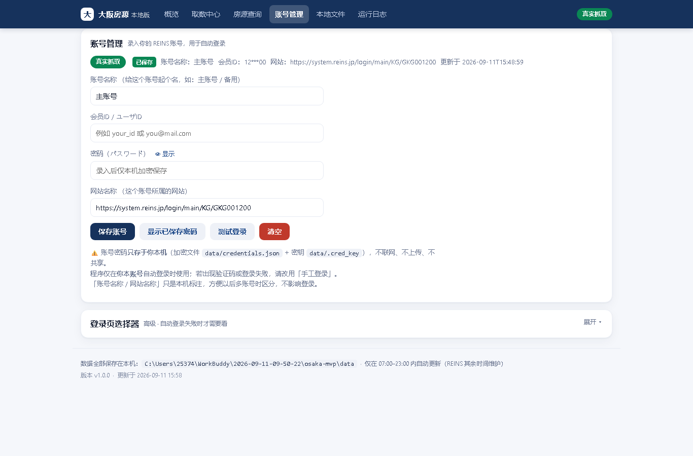

*图：「账号管理」页整页截图*

### 7.1 逐位置说明
| 位置 | 填什么/是什么 | 背后 |
|---|---|---|
| ① 状态行 | 绿"真实抓取/已保存" + 账号名称 + 会员ID(打码) + 网站 + 更新时间 | 显示目前存的账号 |
| ② 账号名称 | 给账号起名（主账号/备用） | 仅标注，不参与登录 |
| ③ 会员ID | REINS 登录账号 | 自动登录时填用户名框 |
| ④ 密码 + 👁显示 | REINS 密码；可明文核对 | 自动登录时填密码框，保存时加密 |
| ⑤ 网站地址 | 这个账号要登录的**网址**（默认已填 `https://system.reins.jp/login/main/KG/GKG001200`） | **真正生效**：自动登录优先用这里填的地址；留空或填的不是网址 → 回退 `config.yaml` 的 `site.login_url` |
| ⑥ 安全说明 | 密码只存本机（credentials.json + .cred_key） | 数据安全边界 |
| ⑦ 登录页选择器 | 高级、可折叠 | 自动登录失败时才需校准网页元素定位 |

> **关于「网站地址」这一格（v1.1.1 起）**
> - 它填的是**网址**，不是"网站名称"，所以标签已正名为**网站地址**。
> - 这个地址**可以改，而且改了就生效**：`…/login/main/KG/GKG001200` 里最后那段 `KG/GKG…` 是**所属机构**编号，换机构 / 换账号时它会变——直接改这一格，保存后自动登录就走新地址，不用再去动配置文件。
> - 换了域名（不只是路径）也认：站点根地址会跟着变，物件详情链接仍能正常生成。
> - 想回到默认？把这一格清空、保存即可（自动回退配置里的默认登录地址）。

*图（v1.1.1）：「账号管理」页的「网站地址」输入区（含说明）——见 `img/v2_account_desk.png`、手机版见 `img/v2_account_mobile.png`*

### 7.2 按钮
| 按钮 | 作用 | 背后 | 何时用 |
|---|---|---|---|
| `保存账号`(见 img/btn_account_0.png) | 加密保存账号 | `/api/credentials` | 首次录入/改密码 |
| `显示已保存密码`(见 img/btn_account_1.png) | 明文显示已存密码 | `/api/credentials?show=1`（限本机） | 想核对密码 |
| `测试登录`(见 img/btn_account_2.png) | 自动登录一次验证 | `/api/login/auto` | 保存后想立刻验证 |
| `清空`(见 img/btn_account_3.png) | **删除本机账号（危险）** | `/api/credentials`(DELETE) | 换账号/不再用 |

> 安全红线：密码只在本机加密保存，不上传；软件也不替你输入验证码，需要验证码请用"手工登录"。

---

## 八、本地文件

**干嘛的**：把抓回来的三类文件列出来，点一下就能打开。

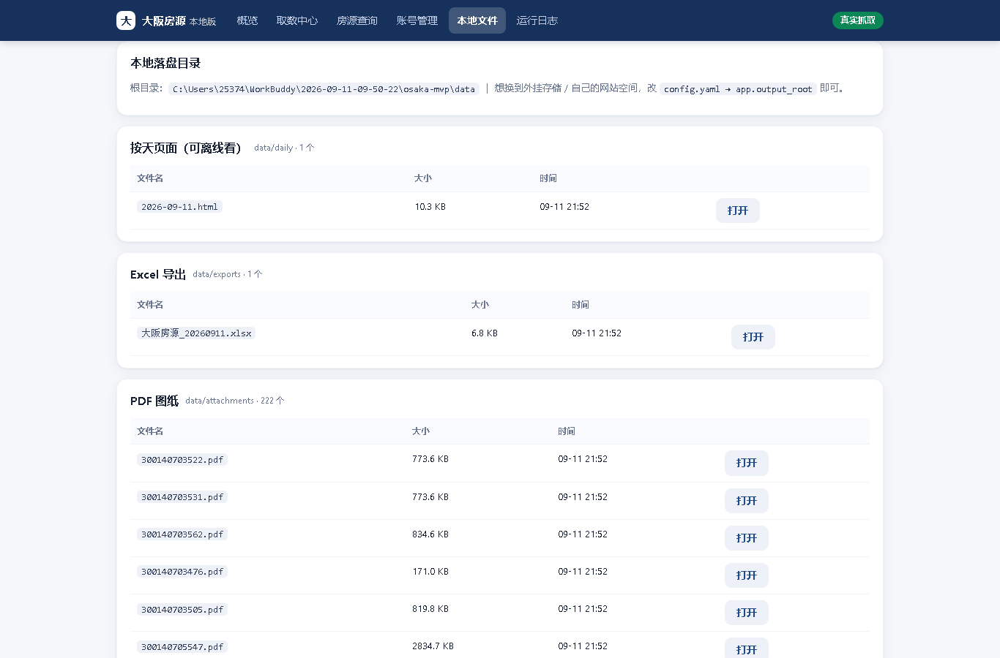

*图：「本地文件」页（视口截图）*

### 8.1 逐位置说明
| 位置 | 功能 | 背后 |
|---|---|---|
| ① 本地落盘目录 | 显示根目录路径；可改 `config.yaml → app.output_root` | 文件实际存在哪 |
| ② 按天页面（可离线看） | 如 `2026-09-11.html`，双击即看 | 每天一个网页清单 |
| ③ Excel 导出 | 如 `大阪房源_20260911.xlsx` | 当天房源导成 Excel，便于转发 |
| ④ PDF 图纸 | 每套 `物件番号.pdf`（示例页 222 个） | 从 REINS 下载的图纸 |

### 8.2 按钮
`打开`(见 img/btn_file_open.png)（每个文件行右侧都有一个）
- **作用**：新标签打开对应文件。
- **背后**：`/download/<目录>/<文件名>`，由本机服务发文件（限定目录、安全只读）。

### 8.3 下载文件清单（条件 × 文件 矩阵）<span class="tag t-green">v1.1.6 新增</span>

**一句话**：不管从哪个入口下载，**一轮跑完固定落 4 类文件**；「条件」只决定**去抓哪些房源**，目前**不决定文件怎么分包**。

#### ① 三个下载入口，各自抓什么 <span class="tag t-green">v1.2.0：由 4 个并为 3 个</span>
| # | 入口 | 在哪 | 抓取范围（条件） | 一次产出 |
|---|---|---|---|---|
| ① | **测试下载数据** | 数据抓取设置 · 第 3 步 | **只跑第 1 个保存条件**，最多 3 条、1 页（最小请求量验证链路） | 4 类文件各 1 份（样本量） |
| ② | **正式下载** | 数据抓取设置 · **第 4 步 下载条件** | **你在第 4 步配的条件**（物件種別 / 種目 / 日期 / 所有権 + 可选条件）；默认 = 公寓 4 種目 + 当天登录 & 当天更新 + 所有権のみ | 4 类文件（**独占执行**：期间暂停「每天自动抓取」，跑完自动恢复） |
| ③ | **每天自动抓取** | 数据抓取设置 · 第 5 步 | 按保存条件全量跑；上限 5000 条 / 300 页，且**每个保存条件各一份配额**（v1.1.12 起不再共用额度，详见 3.8） | 4 类文件 |

> 「保存条件」指 REINS「検索条件の選択・保存（ワンタッチ検索）」里存好的检索条件，**软件按编号取用**，编号列在 `config.yaml → search.saved_conditions`（当前 `['01','02']`）。条件内容以你 REINS 页面上的命名为准。
> 当前映射（`core/crawler.py`）：**売マンション → 02**；**売土地 / 売一戸建 → 01**。
> 你截图里的 **02 =「大阪全市当天有所有权的新建公寓和二手公寓」**，正是这一条。

#### ② 条件 × 文件 矩阵
横向是「条件」这一侧（抓什么），纵向是「文件」这一侧（落下什么）：

| 文件 | 条件 01（売土地 + 売一戸建） | 条件 02（売マンション） | 手动指定（第 4 步 下载条件） |
|---|---|---|---|
| **数据库** `data/jproperty.db` | 写同一张 `properties` 表，用 `kind` / `property_subtype` 区分，**不按条件分库** | 同左 | 同左 |
| **Excel** `data/exports/大阪房源_YYYYMMDD.xlsx` | **全局 1 份**（全量导出、单 sheet、不分条件） | 同左 | 同左 |
| **按天页** `data/daily/YYYY-MM-DD.html` | **全局 1 份/天**（当天新增 + 变更，不分条件） | 同左 | 同左 |
| **図面 PDF** `data/attachments/<物件番号>.pdf` | **每套 1 份**，仅"**新盘 / 首次见到**"才下载 | 同左 | 同左 |
| **照片** | **不下载**（`config.yaml → download.images: false`） | — | — |
| **日志** `data/logs/` | 全局，每轮都追加 | 同左 | 同左 |

#### ③ 必须记住的 3 条
1. **Excel / 按天页不按条件分包**：两个条件抓回来的房源**混在同一份 Excel、同一个按天页**里；想按条件看，用 Excel 里的「**物件種目 / 大类**」两列筛。
2. **PDF 是唯一"按房源分"的文件**：文件名就是**物件番号**，一套一个，不会两张条件重复下同一套。
3. **只有新盘才进详情页 + 下 PDF**：已在本地库里的房源只**刷新列表字段**（价格、有无 PDF 等），不重复下 PDF —— 省时间、也少打扰 REINS。

#### ④ 现在「还没有」的（需要就提）
| 缺什么 | 现状 | 想要的话 |
|---|---|---|
| **首次全量导入**专用按钮 | 没有独立的"全量"按钮；但 **v1.1.12 起**上限已调到 `max_items_per_run: 5000` / `max_pages: 300`，且**每个保存条件各一份配额**，通常**一轮就能把线上有的全抓下来**（详见 3.8） | 若某一类房源超过 5000 条，再调大 `config.yaml` 这两个值即可 |
| **按条件分包的 Excel** | 没有；始终是**一份全量表** | 可做成 `大阪房源_01_20260912.xlsx` / `_02_...` 各一份 |
| **物件照片** | 不下（`images: false`） | 打开配置即可开始下载照片 |
| **条件数量** | 只跑 `saved_conditions` 里列的编号（当前 2 个） | 你在 REINS 里存了 03 / 04，把编号加进配置即可 |

#### ⑤ 每个文件长什么样
- **Excel**：23 列 —— 物件番号 / 房源名称 / 物件種目 / 大类 / 区 / 地址 / 沿線・駅 / 总价(円) / 变更前价格(円) / 土地面積(㎡) / 専有面積(㎡) / ㎡単価 / 坪単価 / 築年月 / 間取り / 所在階 / 画像数 / PDF路径 / 原网页链接 / 登録年月日 / 変更年月日 / 首次发现 / 最近更新。
- **数据库**：5 张表 —— `properties`（主档）、`snapshots`（价格快照）、`changes`（新規 / 降价 / 涨价 / 变更流水）、`runs`（每轮记录）、`watermark`（水位线）。
- **按天页**：离线可看（解决 REINS 23:00–07:00 维护时打不开的问题），每条带「新規 / 降价 / 涨价 / 变更」标签 + 「打开 PDF」+「原网页」两个按钮。

> 软件里怎么看这份清单：**本地文件**页顶部新增一张「**下载文件清单**」说明卡（每轮落哪 4 类文件 + 2 条注意事项），与本节内容对应。

#### ⑥ 下载节奏：模拟人工、避免被平台判定为机器（v1.1.7 新增）
- **核心原则**：抓取的"节奏"要像人，而不是像脚本。REINS 有反爬机制，**均匀、过快的间隔最容易被判成机器/违规**；自然、不规则、带偶尔长停顿的节奏最安全。
- **实测结论**：单条房源间隔里**绝大部分是 REINS 自己吐図面 PDF 的网速（~15–20 秒）**，这部分天然不规则、反而"像人"；真正可调的是代码在两条之间的固定停顿（原来写死 1–2 秒，略显机械）。
- **当前节奏**（`config.yaml → crawl`，可热改、下次下载即生效，无需重启）：
  - `delay_range_seconds: [6, 14]` —— 每条之间的基础停顿随机 6–14 秒（中位数约 10 秒）；
  - `delay_long_range_seconds: [20, 45]` + `delay_long_prob: 0.15` —— 约 15% 的房源会来一次 20–45 秒的"仔细看"长停顿，模拟人偶尔比对、思考；
  - 条件与条件之间也有 8–20 秒的随机停顿。
- **刻意不做的事**：**不开并发多标签同时抓**（那是最明显的机器特征，且易触发限流 / 封号）。要压短单条墙钟只能靠并发，但与"像人"目标冲突，故不采用。
- **想更快 / 更慢**：只改 `config.yaml` 上面三个值即可（如想更跟手就把 `delay_range_seconds` 调小到 `[4, 9]`；想更稳就调大）。改完下次下载自动生效。

### 8.4 变更历史增强（v1.1.8 提出）<span class="tag t-blue">待办</span>

**背景**：用户要的是"历史上拉过的数据 vs 现在的数据，差异要能对比；尤其价格变了，要知道变了多少、**具体哪些字段**变了"。经核实（见 3.5），当前已有三套机制能看**价格级**对比（降价比例徽标 + 详情页「变更历史」+「抓取快照」），基础需求满足。但要做到"字段级 + 完整历史快照"，还有 3 项待办，逐条列出供拍板。

#### ① 历史锚点 bug（已实证，建议优先修）
- **现象**：`core/pipeline.ingest` 对"已存在"房源执行 `rec.setdefault("first_seen_at" / "registration_date", 今天)`，会把**首次发现时间**和**登记日期**覆盖成刷新当天。实证：9号 真实首次是 17:55，但库里 `first_seen_at` 被写成 18:13。
- **影响**：破坏"第一次是什么时候抓到"这个历史基准，对比的锚点失真。
- **修法**：已有房源（`old is not None`）不覆盖 `first_seen_at` 与 `registration_date`，只在首次写入。
- **工作量**：极小（几行），不动抓取节奏，可独立修。

#### ② 字段级 diff 缺口（核心能力缺口）
- **现象**：`changes` 表的「変更」类型只存**指纹哈希**（变了但不知道哪个字段）；`snapshots` 表只存**价格**，不存全字段。
- **用户要的**："具体变更了哪些信息"——例如 専有面積 15.4→18.2㎡、所在階 7階→5階、管理費 4800→5200，要能看到"字段：旧值 → 新值"。
- **做法**：① `changes` 升级成 **field-level diff**（逐字段记 old/new）；② 新建 `versions` 表（或给 `snapshots` 加 `detail_json` 副本列），每次刷新存一份**全字段快照**，这样任意两次之间都能逐字段回放差异。
- **工作量**：中（需改 differ + schema + 详情页渲染）。

#### ③ 変更前価格 要补抓（**已拍板 ✅**）
- **决定**：**要补抓**。在"检测到 変更前価格 / 指纹变化"时，**回详情页补抓** `previous_price` + 重存一份 `detail_json` 历史副本。
- **为什么必须回详情页**：列表网格**没有「変更前価格」列**（`LIST_FIELD_MAP` 无此键），`previous_price` 只能从详情页拿到。所以"仅刷新列表字段"永远更新不到它；只有回详情页才能拿到 REINS 最新的「変更前価格」。
- **实现要点（交给研发）**：
  - **触发**：列表刷新算出的 `fingerprint` 变了（价格 / 面積 / 間取り / 階数 等任一变）→ 回详情页 → 详情抓取自然刷新 `previous_price` 与全字段；同时把这次的 `detail_json` 存一份历史副本（对应 ② 的 versions / 快照）。
  - **边界（务必知道）**：`previous_price` 单独变化、而 `price` 等指纹字段都没变时，**列表刷新看不出来**（列表没有这列、指纹也不含它）→ 不会触发回详情页。若要连这种"只改了变更前価格"的边角也抓到，需额外把 `previous_price` 纳入指纹、或给详情页加一个轻量回查（代价是更多次进详情页）。落地时按"常见场景（价格变 → 触发）优先、边角场景记为 known limitation"处理。
- **与 ② 的关系**：③ 的"存 `detail_json` 历史副本"和 ② 的 versions 表是同一件事，合并实现。

> **当前状态**：① 已实证、建议先修；② ③ 已明确方向，等拍板优先级后即可排期落地（不阻塞当前使用）。

### 8.5 新增物件自动推送 · 产品方案 <span class="tag t-blue">仅方案 / 未实现</span>

**背景**：用户希望"新增物件"能**自动推到不同地区的同事那边"——覆盖**日本 / 中国香港 / 中国澳门 / 中国大陆**四地。本方案作为**产品经理视角的设计稿**（配套完整文档见 `docs/自动推送新增物件_产品方案_v0.1.md`），**当前仅方案、未写代码**，供拍板与排期用。

**一句话结论**：单一推送渠道不够——四地同事常用的 IM 完全不同（日本用 LINE、港澳用 WhatsApp、大陆用企业微信/钉钉），**必须做"事件 → 规则引擎 → 模板渲染 → 多渠道适配器"的中台式架构**，由一套规则把"新增/降价/变更"事件翻译成各渠道适配的卡片，再按收件人本地时区投递。不能硬写一个"群发所有渠道"的接口。

**核心架构（建议）**：
```
REINS 抓取 → changes 表（new/price_down/price_up/modified）
        ↓
   规则引擎（按 收件人分组 / 物件条件 / 频次 匹配）
        ↓
   模板渲染（多语言：简/繁/EN/日 + 可选 CNY 折算）
        ↓
  ┌─────┴──────┬──────────┬─────────┬────────┐
渠道适配器  企业微信      邮件      WhatsApp    LINE      （飞书/Chatwork/Telegram/SMS 备选）
        ↓
  deliveries 表（投递记录 / 失败重试 / 频控）
```

**受众分群与渠道（初版建议）**：
| 群 | 地区 | 主渠道 | 备注 |
|---|---|---|---|
| A | 日本本地同事 | **LINE** | 日文卡片；可带図面 PDF 缩略 |
| B | 中国香港同事 | **WhatsApp** | 繁体；可走 WhatsApp Business API |
| C | 中国澳门同事 | **WhatsApp** | 繁体（与港澳同渠道，可并群或独立群） |
| D | 中国大陆同事 | **企业微信**（钉钉备选） | 简体；可带内部链接 |
| E | 管理层 / 自己 | **邮件** | 日报汇总卡片，简体 |

**推送内容形态**：① 新增卡片（新房源关键信息 + 链接）② 降价卡片（降了多少 / 几个点）③ 变更卡片（字段级变化，依赖 8.4 ②）④ 日报（每日汇总，供管理层）。

**节奏与合规**：
- 节奏按收件人**本地时区 08:00–21:00** 投递；实时推送（新增即时）与**日报**（每日定点）混合，由规则引擎控制频次、避免刷屏。
- **合规红线（务必前置）**：REINS 数据**仅限内部同事**，**绝不外发客户 / 公网**；日本侧注意 PDPO / 个人信息处理，中国大陆侧注意数据出境合规，港澳侧走 WhatsApp 须确认不触数据跨境限制。凭证（API Key / Token）**绝不进 PRD、绝不落库明文**。

**MVP 分步（建议）**：
- **M1（保底）**：邮件 + 企业微信，先把"新增/降价"推起来，验证事件→规则→模板→投递闭环；
- **M2**：接入 WhatsApp（港澳）；
- **M3**：接入 LINE（日本）+ 实时推送；
- **M4**：自助订阅（同事自己选要看哪类、推到哪）。

**待确认（6 项）**：① 各群具体收件人名单与分组；② 哪些事件要推（仅新增？还是含降价/变更）；③ 频次（实时 vs 日报）；④ 各渠道 API 资质与预算（WhatsApp/LINE 有成本）；⑤ 多语言由谁定稿；⑥ 数据合规由谁拍板（尤其跨境）。

> 本方案**复用现有能力**：直接消费 `changes` 表；定时调度可复用已存在的"每日 PRD 检查"那套自动化框架（定时 + 汇报）。拍板后再拆成研发事项。

---

## 九、运行日志

**干嘛的**：抓取的"行车记录仪"。

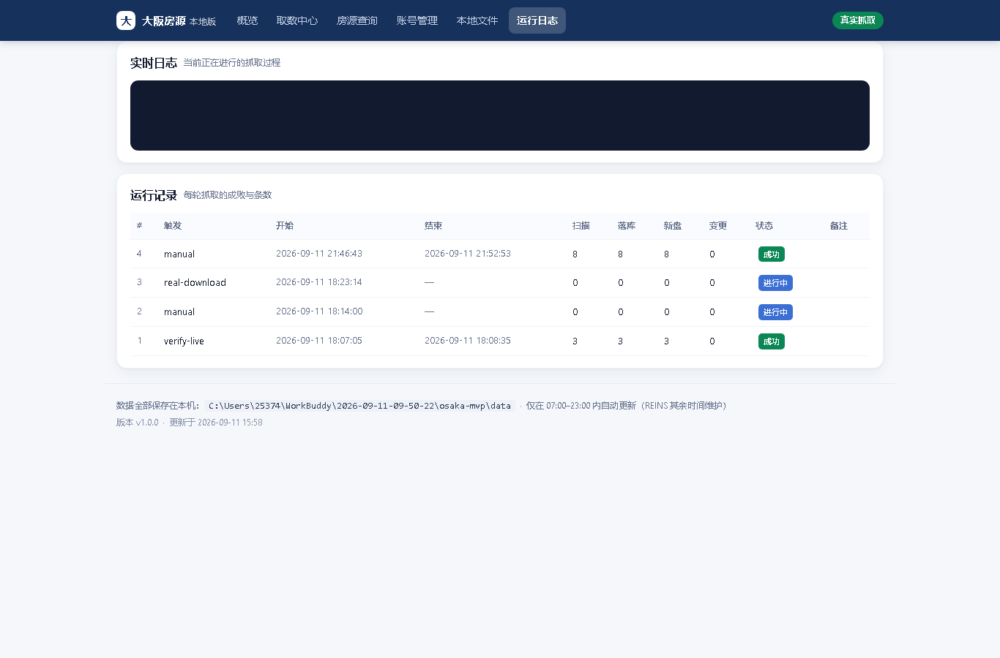

*图：「运行日志」页整页截图*

### 9.1 逐位置说明
| 位置 | 是什么 | 含义 |
|---|---|---|
| ① 实时日志 | 深色滚动日志框 | 软件正在做的事逐行输出 |
| ② 运行记录表 | 每轮抓取一行 | # 轮次；触发（manual/real-download/verify-live…）；开始/结束（"—"=还在跑）；扫描；落库；新盘；变更；状态（成功/进行中/失败）；备注 |

> 本页**没有按钮**，因为它纯"查看"、只读。
> 排查小抄：点完"手动更新"没反应？看最新一行状态——进行中=还在跑；成功但落库 0=没新盘很正常；失败=看"备注"和实时日志里的报错。

---

## 十、按钮关系总图 & 常见任务怎么点

### 10.1 主流程
`账号管理：保存账号` → `数据抓取设置：①测试登录` → `②测试查询` → `③测试下载` → `④真实下载` → `概览看结果` → `房源查询看数据`（看到中意的 → `加入对比` → `房源对比`横向比）
（日常可跳过测试，直接用【概览】"手动更新"，或开启【数据抓取设置】第 4 步的自动更新。）

| 按钮 | 属于 | 背后动作 | 和谁有关 |
|---|---|---|---|
| 保存账号 | 账号管理 | 加密写本机 credentials.json | ①测试登录依赖它 |
| ① 测试登录 | 数据抓取设置/账号管理 | `/api/login/auto` 自动登录存会话 | ②③④的前提 |
| ② 测试查询 | 数据抓取设置 | `/api/query/test` 最小查询不落库 | 验证登录后能查到 |
| ③ 测试下载数据 | 数据抓取设置 | `/api/download/test` 小量真下载 | ④的彩排 |
| ④ 真实下载数据 | 数据抓取设置 | `/api/download/real` 全量落库 | 结果见概览/查询/文件 |
| 手动更新 / 试跑 | 概览 | `/api/run`（全量/trial） | 与④同一套抓取 |
| 保存并启动自动更新 | 数据抓取设置 | `/api/schedule` 开启定时 | 之后自动跑④ |
| 查询 / 重置 | 房源查询 | `/api/query` 查本地库 | 数据来自④/手动更新 |
| 加入对比 / 开始对比 | 房源查询 / 对比栏 | 写本地对比栏 → `/compare` | 进入【房源对比】 |
| 打开 | 本地文件 | `/download/…` 取回落盘文件 | 文件来自④ |

### 10.2 常见任务，一步到位
- **A 第一次跑通全流程**：账号管理保存账号 → 数据抓取设置 开始自检 → ①测试登录 → ②测试查询 → ③测试下载 → ④真实下载。
- **B 只想看数据**：概览看 KPI → 房源查询筛选 → 点标题进详情。
- **C 想横向比几套房**：查询页给看中的每套点「加入对比」（≤6）→ 点底部「开始对比」进【房源对比】页，开「标出最优/隐藏相同项」快速看优劣。
- **D 想定时自动更新**：先跑通一次 → 数据抓取设置第 4 步设随机 1~3h、时段 07:00–23:00 → 保存并启动自动更新。
- **E 想此刻更新一次**：概览 点「▶ 手动更新」→ 运行日志看进度 → 概览「🔄 刷新一次」。
- **F 登录失败/要验证码**：数据抓取设置「手工登录（打开浏览器）」→ 手输账号密码+验证码。
- **G 下载的文件在哪**：本地文件 → 找到文件 → 点「打开」；或去页脚显示的目录复制。

---

## 十一、名词小词典
| 名词 | 白话解释 |
|---|---|
| REINS | 日本不动产流通信息系统（房源数据来源，需登录），抓取的"源头" |
| 抓取 / 抓一轮 | 软件自动打开 REINS、检索、抄回信息与 PDF 的过程；一轮=把所有保存条件跑一遍 |
| 落库 | 把抓到数据写进本机数据库（jproperty.db） |
| 真实抓取 / 离线演示 | 连真 REINS / 只用内置样例数据 |
| 会话(session) | 登录后保存的登录状态文件，之后不必每次重登 |
| PDF 图纸 | 房源图纸，存在 `data/attachments` |
| 試跑/trial | 最小范围（1 轮/最多 3 条）的小样抓取 |
| 新規/降价/変更 | 房源变化类型：首次发现 / 价格下调 / 其他变更 |
| 専有面積 / 土地面積 | 专有面积（公寓室内）/ 土地面积，单位 ㎡ |
| ㎡単価 | 每平方米单价（日元） |
| 登記年月日 | 该房产登记日期 |
| 运行时段/窗口 | 允许自动更新的时间段（默认 07:00–23:00） |
| 加入对比 / 对比栏 | 把看中的房子暂存到本地（≤6 套），用于进【房源对比】页横向比 |

---

*本说明由软件**真实运行界面**截图整理而成（截图时间 2026-09-11，模式：真实抓取，本地库示例数据 11 条房源 / 222 份 PDF）。界面若有更新，请以最新版本为准。v1.1.0 新增【房源对比】页与查询/详情优化；v1.1.2 修复"清空"相关 2 个 bug、详情页对比改两步走、对比页加"还不够 2 套"引导页；v1.1.3 新增右上角语言切换（简/繁/EN/日），并约定"新增内容须同步进 PRD 与软件代码"；v1.1.4 在查询/详情/对比三处价格旁新增降价比例（降价額 ÷ 修改前金額，带 %）；v1.1.5 把该比例移到「降价金額」与「当前金額」中间，并改成与降价金額同款绿胶囊；v1.1.6 新增 8.3「下载文件清单（条件 × 文件 矩阵）」，把 4 个下载入口各自抓什么、每轮到底落下哪些文件、以及是否按条件分包，一次讲清；v1.1.7 把下载节奏改成"模拟人工"（随机停顿 + 偶尔长停顿、不开并发），核心是不被 REINS 判成机器；v1.1.8 澄清降价差额的数据原点（徽标"降了多少" = 本机 `previous_price` − `price`，是 REINS 自报的"上一跳"单步降幅，非累计降幅），并新增 8.4「变更历史增强」——拍板「変更前価格 要补抓」、列出 3 项待办（历史锚点 bug / 字段级 diff / 补抓边界）；v1.1.9 把「物件種目」筛选改成两级目录 + 多选——一级＝一戸建 / 公寓（マンション）/ 土地（含兜底「其他」组）、二级＝新築 / 中古，支持"同时选不同一级（一戸建+公寓）"与"同时选新+中古"两类多选，一级勾选框为整组开关、都不勾＝不限，归不进目录的原始種目（如「中古マンション／オーナーチェンジ」）自动进「其他」组用原始種目精确匹配兜底、保证任何一条房源都筛得出来。v1.1.10 新增「物件種目」两级目录复选框联动（① 一级类目 / ② 二级类目，先勾一级、二级才可选）、列表行「新增 / 变更」状态标（绿＝新增 / 橙＝变更）、以及 8.5 自动推送方案；v1.1.11 把二级種目补全为 REINS 原版（一戸建 4 個、公寓 4 個，名称采用 REINS 原值，「中古タウン」归位到公寓下）；v1.1.12 修掉两个用户报的 bug——① 下载到的条数比线上少（配额硬截断 + 多条件共用额度 + 種目只填一个 ⇒ 改成 5000 条/300 页、每个条件各一份配额、同一次检索填满 4 个種目槽位并勾「所有権のみ」，详见 3.8）；② 对比栏里每套房的概况小卡整片消失（局部变量遮蔽全局文案函数 `t()` 导致渲染中断，详见 3.3）；v1.2.0 做结构改版——把「指定日期下载」并入「数据抓取设置」成为「第 4 步 下载条件」（导航 8 项→7 项）、更新方式改分钟制并把按钮改叫「保存并启动」、下载条件分核心/可选/补充三层且可选默认不勾、正式下载合并为一个按钮、对比栏小卡改「名称/地址(含区)/専有面積/价格」、查询页记住上次条件、对比页列头精简为「位置/名称/价格/面积」、展开区英文字段名全部四语言化（新增公共词典 fieldmap.js）。截图文件见 `img/v2_*.png`。*
